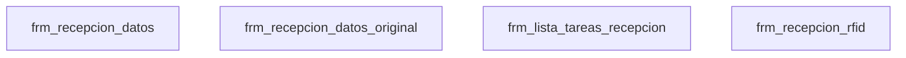
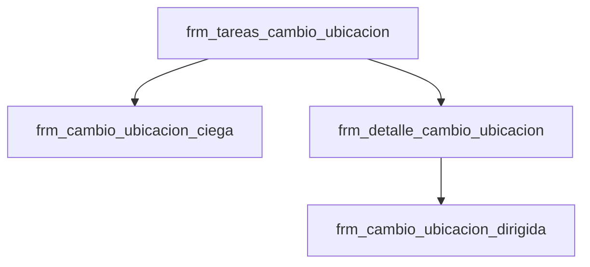
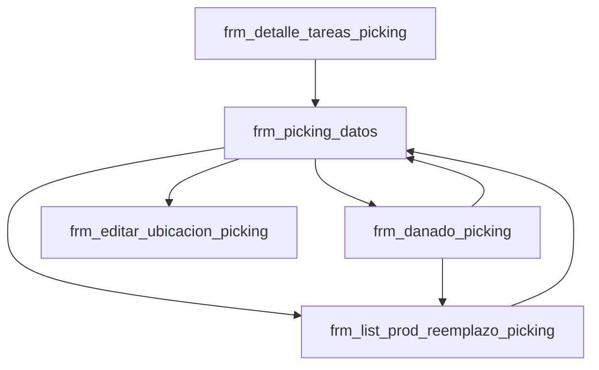
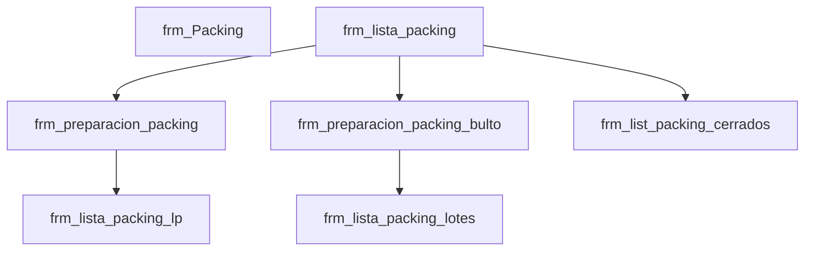
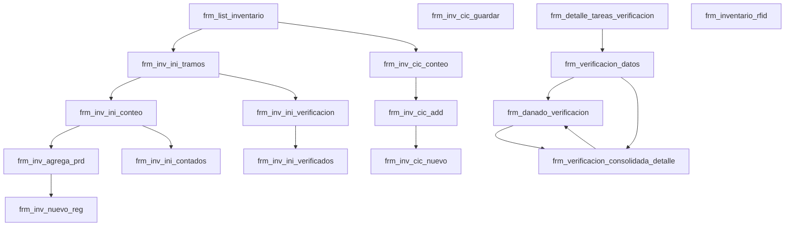
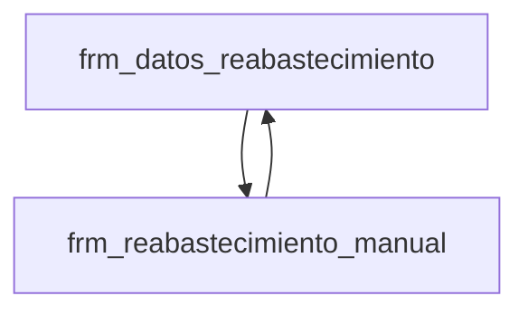
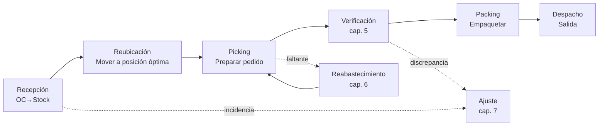

# Ciclo 3.2 D — Flujos end-to-end del HH (TOM WMS Killios)

**Generado**: 2026-04-27T05:58:23.691Z  
**Fuente**: derivado 100% de catálogos ciclo 3.2 A (BOF), B (HH Android) y C (Killios deep) ya en `wms-brain`.

## Resumen ejecutivo

Este ciclo reconstruye los **flujos end-to-end** del operador del Handheld Android para los 6 dominios operativos del WMS más 2 dominios server-only (ajuste y despacho), sin parsear código nuevo: solo navega y narra los catálogos previos.

| Dominio | Activities HH | WMs únicos | Tablas escritas | Tablas leídas | Errores log |
|---|---:|---:|---:|---:|---:|
| **recepcion** | 4 | 53 | 24 | 26 | 9 |
| **reubicacion** | 4 | 33 | 12 | 15 | 15 |
| **picking** | 5 | 35 | 14 | 14 | 0 |
| **packing** | 7 | 24 | 14 | 14 | 0 |
| **inventario** | 17 | 80 | 30 | 32 | 0 |
| **reabastecimiento** | 2 | 6 | 6 | 6 | 0 |
| **ajuste** | 0 | 5 | 2 | 3 | 10 |
| **despacho** | 0 | 1 | 2 | 3 | 0 |

**Cobertura**: 39 activities HH cubren los 6 dominios principales. `despacho` y `ajuste` no tienen activities HH dedicadas en el manifest analizado — su lógica vive 100% server-side y se invoca desde otras pantallas (típicamente desde finalización de packing/recepción).

**Métrica del grafo unificado**: 303 nodos ({"domain":8,"activity":39,"wm":199,"table":57}), 1939 aristas ({"contains":39,"invokes":329,"writes":624,"reads":889,"intentTo":52,"owns":6}).

## Limitaciones del catálogo

1. El catálogo BOF (`ws-sql-inline.json`) extrajo **0 tablas read/write directas en los WMs** (su `tablesWrite` está vacío para los 371 WMs). En este ciclo se resolvieron las tablas por **vía indirecta**: `WM.clsLnUsed → DAL.tables/verbs`. Esto puede infrarepresentar tablas tocadas por SQL inline en los WMs (no via DAL).
2. Las activities HH `despacho` y `ajuste` no aparecen como subpaquetes en `com.dts.tom.Transacciones` (la inspección reportó 0 matches por nombre directo). Se documentan como **dominios server-only**.
3. Los errores se cruzan por palabras clave + WMs invocados. Para los dominios picking, packing, inventario y reabastecimiento la heurística textual no produjo matches en los top-30 errores — esto puede deberse a que los errores top son del log de `Aplica_Cambio_Estado_Ubic_HH` (reubicación) y de WMs genéricos (Get_*).

## Cómo leer cada capítulo

Cada dominio tiene: resumen, diagrama mermaid de transiciones, tabla de activities ordenadas por tamaño, top 25 WMs por apariciones, lista de tablas mutadas, catálogos de estado, WMs de finalización, casos borde y errores típicos del log productivo.

## Capítulo 1 — Recepción de mercadería (entrada)

**Activities HH**: 4 · **WMs únicos invocados**: 53 · **Tablas escritas**: 24 · **Tablas leídas**: 26

### Resumen del flujo

El operador del HH abre la pantalla de tareas de recepción, selecciona una orden de compra (OC) pendiente, escanea los productos físicos contra el detalle de la OC, marca incidencias (sobrante/faltante/dañado) y finaliza. La activity más cargada es `frm_recepcion_datos` (11.5K líneas, 46 invocaciones a 42 WMs distintos) — es el corazón del flujo. La rama RFID (`frm_recepcion_rfid`) es alternativa moderna pero usa el mismo set de WMs de cierre.

### Diagrama de pantallas (intentTo)

### Activities (orden por tamaño)

| Activity | Layout | Líneas .java | WMs invocados | intent→ |
|---|---|---|---|---|
| frm_recepcion_datos | activity_frm_recepcion_datos | 11482 | 46 | 3 |
| frm_recepcion_datos_original | activity_frm_recepcion_datos | 11371 | 46 | 3 |
| frm_lista_tareas_recepcion | activity_frm_lista_tareas_recepcion | 1149 | 11 | 6 |
| frm_recepcion_rfid | activity_frm_recepcion_rfid | 1297 | 0 | 1 |

### WMs invocados (top 25 por aparición)

| WM | Apariciones | BodyLines | Tablas write | Tablas read |
|---|---|---|---|---|
| Existe_LP_By_IdRecepcionEnc_And_IdRecepcionDet | 4 | 47 | trans_re_det | trans_re_det |
| Get_IdUbicMerma_By_IdBodega | 4 | 42 | bodega, log_error_wms | bodega, log_error_wms, usuario |
| Guardar_Recepcion | 4 | 74 | trans_re_enc | trans_re_enc |
| Get_Detalle_OC_By_IdOrdeCompraDet | 4 | 44 | log_error_wms | log_error_wms, trans_oc_det, usuario |
| Get_Producto_By_IdProductoBodega | 2 | 42 | log_error_wms, producto_bodega | log_error_wms, producto_bodega, usuario |
| Get_Estados_By_IdPropietario_And_IdBodegaHH | 2 | 45 | log_error_wms, producto_estado | log_error_wms, producto_estado, usuario |
| Get_All_Presentaciones_By_IdProducto | 2 | 42 | log_error_wms, producto_presentacion | log_error_wms, producto_presentacion, usuario |
| Get_All_Codigos_Barra_By_IdProducto | 2 | 42 | log_error_wms, producto | log_error_wms, producto, usuario |
| Get_All_ProductoParametros_By_IdProducto_HH | 2 | 42 | log_error_wms, producto_parametros | log_error_wms, producto_parametros, usuario |
| Get_Resoluciones_Lp_By_IdOperador_And_IdBodega | 2 | 47 | log_error_wms, resolucion_lp_operador | log_error_wms, resolucion_lp_operador, usuario |
| Get_Nuevo_Correlativo_LicensePlate | 2 | 47 | log_error_wms, stock_rec | log_error_wms, stock_rec, usuario |
| Get_Licenses_Plates_By_IdRecepcionEnc | 2 | 43 | — | — |
| MaxIDStockSeRec | 2 | 41 | log_error_wms, stock_se_rec | log_error_wms, stock_se_rec, usuario |
| Get_All_Params_By_IdRecepcionEnc_And_IdRecepcion_Det_For_HH | 2 | 43 | trans_re_det_parametros | — |
| MaxIDStockRec | 2 | 41 | log_error_wms, stock_rec | log_error_wms, stock_rec, usuario |
| Get_BeTransReEnc_By_IdREcepcionEnc_For_HH | 2 | 43 | trans_re_enc | trans_re_enc |
| Get_Nuevo_Correlativo_LicensePlate_S | 2 | 50 | log_error_wms, stock_rec | log_error_wms, stock_rec, usuario |
| Guardar_Recepcion_Sin_Presentacion | 2 | 68 | trans_re_enc | trans_re_enc |
| Guardar_Recepcion_Caja_Master | 2 | 62 | log_error_wms, trans_re_enc | log_error_wms, trans_re_enc, usuario |
| Guardar_Recepcion_S | 2 | 77 | trans_re_enc | trans_re_enc |
| GuardarRecepcionModif | 2 | 65 | trans_re_enc | trans_re_enc |
| Max_IdRecepcion_Det_By_IdRecepcionEnc | 2 | 40 | trans_re_det | trans_re_det |
| Finalizar_Recepcion_Parcial_Pallet_Proveedor | 2 | 59 | trans_re_enc | trans_re_enc |
| Get_All_BeTrasReDet_By_IdOrdenCompraEnc | 2 | 42 | log_error_wms, trans_re_det | log_error_wms, trans_re_det, usuario |
| Get_Stock_By_IdRecepcionEnc_And_IdRecpecionDet | 2 | 43 | stock_rec | stock_rec |

### Tablas mutadas en este dominio (24)

`bodega`, `color`, `i_nav_transacciones_push`, `log_error_wms`, `log_verificacion_bof`, `producto`, `producto_bodega`, `producto_estado`, `producto_imagen`, `producto_parametros`, `producto_presentacion`, `resolucion_lp_operador`, `stock`, `stock_rec`, `stock_se_rec`, `talla`, `tarea_hh`, `tipo_etiqueta`, `trans_oc_det_lote`, `trans_pe_enc`, `trans_re_det`, `trans_re_det_parametros`, `trans_re_enc`, `trans_re_img`

### Catálogos de estado relacionados

- `trans_oc_estado` (6 filas)

| IdEstadoOC | Nombre |
|---|---|
| 6 | BACK ORDER |
| 5 | ANULADA |
| 4 | CERRADA |

- `sis_estado_tarea_hh` (4 filas)

| IdEstado | descripcion |
|---|---|
| 4 | Finalizado |
| 3 | Anulado |
| 2 | Pendiente |

### WMs de finalización / commit

`Guardar_Recepcion`, `Guardar_Recepcion_Sin_Presentacion`, `Guardar_Recepcion_Caja_Master`, `Guardar_Recepcion_S`, `GuardarRecepcionModif`, `Finalizar_Recepcion_Parcial_Pallet_Proveedor`, `Guardar_Producto_Imagen`, `Guardar_Fotos_Recepcion`

### WMs de operación parcial

`Finalizar_Recepcion_Parcial_Pallet_Proveedor`

### Casos borde detectados

- **Alternativas para `get_nuevo_correlativo_licenseplate`**: `Get_Nuevo_Correlativo_LicensePlate`, `Get_Nuevo_Correlativo_LicensePlate_S`
- **Alternativas para `guardar_recepcion`**: `Guardar_Recepcion`, `Guardar_Recepcion_S`

### Errores típicos del log productivo (top 9)

| Count | ItemsAfectados | Usuarios | Mensaje |
|---|---|---|---|
| 474 | 0 | 0 | Guarda_Trans_re_det 1Actualiza_Cantidad_Recibida_OC 1 Guarda_Stock_Rec 1Insertar_Movimientos_Recepcion IdMovimiento: <NU |
| 285 | 0 | 0 | Guarda_Trans_re_det 2Actualiza_Cantidad_Recibida_OC 1 Guarda_Stock_Rec 1Insertar_Movimientos_Recepcion IdMovimiento: <NU |
| 212 | 0 | 0 | Guarda_Trans_re_det 3Actualiza_Cantidad_Recibida_OC 1 Guarda_Stock_Rec 1Insertar_Movimientos_Recepcion IdMovimiento: <NU |
| 179 | 0 | 0 | Guarda_Trans_re_det 4Actualiza_Cantidad_Recibida_OC 1 Guarda_Stock_Rec 1Insertar_Movimientos_Recepcion IdMovimiento: <NU |
| 174 | 0 | 0 | Reemplazar_ListaPu_By_Stock Error_Reemplazo_A: No es posible reservar más de lo solicitado |
| 152 | 0 | 0 | Guarda_Trans_re_det 5Actualiza_Cantidad_Recibida_OC 1 Guarda_Stock_Rec 1Insertar_Movimientos_Recepcion IdMovimiento: <NU |
| 137 | 0 | 0 | Guarda_Trans_re_det 6Actualiza_Cantidad_Recibida_OC 1 Guarda_Stock_Rec 1Insertar_Movimientos_Recepcion IdMovimiento: <NU |
| 122 | 0 | 0 | Guarda_Trans_re_det 7Actualiza_Cantidad_Recibida_OC 1 Guarda_Stock_Rec 1Insertar_Movimientos_Recepcion IdMovimiento: <NU |
| 121 | 0 | 0 | Guarda_Trans_re_det 8Actualiza_Cantidad_Recibida_OC 1 Guarda_Stock_Rec 1Insertar_Movimientos_Recepcion IdMovimiento: <NU |

### Strings UI mostrados al operador (sample)

- "TOMWMS"

## Capítulo 2 — Reubicación / cambio de ubicación interno

**Activities HH**: 4 · **WMs únicos invocados**: 33 · **Tablas escritas**: 12 · **Tablas leídas**: 15

### Resumen del flujo

El operador mueve stock entre ubicaciones del almacén (típicamente para consolidar, liberar espacio o atender una solicitud BOF). Hay dos modalidades: **ciega** (el sistema sugiere la ubicación destino) y **dirigida** (el operador propone destino y el sistema valida). El WM crítico es `Aplica_Cambio_Estado_Ubic_HH` — es el **top error #1 del log productivo con ~1,800 ocurrencias** (ver capítulo de errores). El cierre toca `trans_ubic_hh_det` y `stock_*`.

### Diagrama de pantallas (intentTo)

### Activities (orden por tamaño)

| Activity | Layout | Líneas .java | WMs invocados | intent→ |
|---|---|---|---|---|
| frm_cambio_ubicacion_ciega | activity_frm_cambio_ubicacion_ciega | 5335 | 31 | 2 |
| frm_cambio_ubicacion_dirigida | activity_frm_cambio_ubicacion_dirigida | 1076 | 5 | 0 |
| frm_detalle_cambio_ubicacion | activity_frm_detalle_cambio_ubicacion | 700 | 3 | 1 |
| frm_tareas_cambio_ubicacion | activity_frm_tareas_cambio_ubicacion | 451 | 1 | 2 |

### WMs invocados (top 25 por aparición)

| WM | Apariciones | BodyLines | Tablas write | Tablas read |
|---|---|---|---|---|
| Get_Single_By_IdEstado | 2 | 42 | log_error_wms, producto_estado | log_error_wms, producto_estado, usuario |
| Get_Productos_By_IdUbicacion_Existencias_JSON | 2 | 72 | log_error_wms, stock | log_error_wms, usuario |
| Get_Productos_By_IdUbicacion_JSON | 2 | 71 | stock | — |
| Get_Ubicacion_By_Codigo_Barra_And_IdBodega_JSON | 2 | 46 | bodega_ubicacion | bodega_ubicacion |
| Actualizar_Trans_Ubic_HH_Det | 2 | 68 | log_error_wms, trans_ubic_hh_det | log_error_wms, trans_ubic_hh_det, usuario |
| Es_Pallet_No_Estandar | 2 | 42 | log_error_wms, stock | log_error_wms, usuario |
| Tiene_Posiciones | 2 | 42 | log_error_wms, stock | log_error_wms, usuario |
| Get_IdUbicacion_Recepcion_By_IdBodega_Json | 1 | 46 | bodega | bodega |
| Get_Motivos_Ubicacion_For_HH | 1 | 44 | log_error_wms, motivo_ubicacion | log_error_wms, motivo_ubicacion, usuario |
| Get_BeProducto_By_Codigo_For_HH_JSON | 1 | 49 | log_error_wms, producto | log_error_wms, producto, usuario |
| Get_Stock_By_Lic_Plate_JSON | 1 | 83 | log_error_wms, stock | log_error_wms, usuario |
| Get_Productos_By_IdUbicacion_And_LicPlate_JSON | 1 | 81 | log_error_wms, stock | log_error_wms, usuario |
| Get_Resoluciones_Lp_By_IdOperador_And_IdBodega | 1 | 47 | log_error_wms, resolucion_lp_operador | log_error_wms, resolucion_lp_operador, usuario |
| Set_Nuevo_Pallet_Id | 1 | 77 | log_error_wms, stock | log_error_wms, usuario |
| Get_Estados_By_IdPropietario_JSON | 1 | 56 | log_error_wms, producto_estado | log_error_wms, producto_estado, usuario |
| Aplica_Cambio_Estado_Ubic_HH | 1 | 68 | log_error_wms, trans_ubic_hh_det | log_error_wms, trans_ubic_hh_det, usuario |
| ml_get_ubicacion_sugerida_JSON | 1 | 90 | log_error_wms | log_error_wms, usuario, vw_ocupacionbodegatramo, vw_stock_res |
| Get_Stock_By_Lic_Plate_And_Codigo | 1 | 46 | log_error_wms, stock | log_error_wms, usuario |
| Existe_Lp_By_Licencia_And_IdBodega_JSON | 1 | 44 | log_error_wms, stock, stock_rec | log_error_wms, stock_rec, usuario |
| Es_Pallet_No_Estandar_JSON | 1 | 29 | log_error_wms, stock | log_error_wms, usuario |
| Ubicacion_Es_Valida_JSON | 1 | 68 | log_error_wms | log_error_wms, usuario |
| Actualizar_Ubicaciones_Reservadas_By_IdStock | 1 | 49 | log_error_wms, stock_res | log_error_wms, stock_res, usuario |
| Actualizar_Ubicaciones_Reservadas_By_StockRes | 1 | 49 | log_error_wms, stock_res | log_error_wms, stock_res, usuario |
| Get_Productos_By_StockResCI | 1 | 42 | log_error_wms, stock | log_error_wms, usuario |
| Aplica_Cambio_Estado_Ubic_HH_LicCompleta | 1 | 48 | log_error_wms, trans_ubic_hh_det | log_error_wms, trans_ubic_hh_det, usuario |

### Tablas mutadas en este dominio (12)

`bodega`, `bodega_ubicacion`, `log_error_wms`, `motivo_ubicacion`, `producto`, `producto_estado`, `resolucion_lp_operador`, `stock`, `stock_rec`, `stock_res`, `trans_ubic_hh_det`, `trans_ubic_hh_enc`

### Catálogos de estado relacionados

- `sis_estado_tarea_hh` (4 filas)

| IdEstado | descripcion |
|---|---|
| 4 | Finalizado |
| 3 | Anulado |
| 2 | Pendiente |

- `producto_estado_ubic` (2 filas)

| IdProductoEstadUbic | IdEstado | IdUbicacionDefecto | fec_agr |
|---|---|---|---|
| 2 | 2 | 722 | 2025-06-06T19:19:10.127Z |
| 1 | 16 | 2 | 2025-06-02T17:18:26.607Z |

### Casos borde detectados

- **Operaciones sobre reservas/asignaciones**: `Actualizar_Ubicaciones_Reservadas_By_IdStock`, `Actualizar_Ubicaciones_Reservadas_By_StockRes`

### Errores típicos del log productivo (top 15)

| Count | ItemsAfectados | Usuarios | Mensaje |
|---|---|---|---|
| 1800 | 0 | 0 | Aplica_Cambio_Estado_Ubic_HH: llamada de WS con usuario: 70 y TipoTarea 2 |
| 915 | 0 | 0 | AVISO_20242211_HH_CambioEstadoUbic: ubicacion: 716 ubicacion anterior 0opoerador 70 |
| 868 | 0 | 0 | Aplica_Cambio_Estado_Ubic_HH: llamada de WS con usuario: 67 y TipoTarea 2 |
| 707 | 0 | 0 | Aplica_Cambio_Estado_Ubic_HH: llamada de WS con usuario: 43 y TipoTarea 2 |
| 456 | 0 | 0 | AVISO_20242211_HH_CambioEstadoUbic: ubicacion: 716 ubicacion anterior 0opoerador 43 |
| 442 | 0 | 0 | Aplica_Cambio_Estado_Ubic_HH: llamada de WS con usuario: 64 y TipoTarea 2 |
| 355 | 0 | 0 | Aplica_Cambio_Estado_Ubic_HH: llamada de WS con usuario: 62 y TipoTarea 2 |
| 308 | 0 | 0 | Aplica_Cambio_Estado_Ubic_HH: llamada de WS con usuario: 76 y TipoTarea 2 |
| 242 | 0 | 0 | Aplica_Cambio_Estado_Ubic_HH: llamada de WS con usuario: 72 y TipoTarea 2 |
| 214 | 0 | 0 | AVISO_20242211_HH_CambioEstadoUbic: ubicacion: 716 ubicacion anterior 0opoerador 62 |

### Strings UI mostrados al operador (sample)

- "TOMWMS"

## Capítulo 3 — Picking (preparación de pedidos)

**Activities HH**: 5 · **WMs únicos invocados**: 35 · **Tablas escritas**: 14 · **Tablas leídas**: 14

### Resumen del flujo

El operador recibe una tarea de picking generada por el BOF, recorre las ubicaciones, escanea producto y cantidad, marca incidencias (faltante → reemplazo, dañado → `frm_danado_picking`) y cierra la tarea. La activity `frm_list_prod_reemplazo_picking` permite resolver faltantes vendiendo un sustituto. `frm_editar_ubicacion_picking` permite ajustar ubicación si el producto está físicamente en otra parte. El cierre confirma cantidades y libera reserva (`stock_res`).

### Diagrama de pantallas (intentTo)

### Activities (orden por tamaño)

| Activity | Layout | Líneas .java | WMs invocados | intent→ |
|---|---|---|---|---|
| frm_picking_datos | activity_frm_picking_datos | 3329 | 18 | 4 |
| frm_detalle_tareas_picking | activity_frm_detalle_tareas_picking | 1741 | 9 | 1 |
| frm_list_prod_reemplazo_picking | activity_frm_list_prod_reemplazo_picking | 1082 | 6 | 1 |
| frm_danado_picking | activity_frm_danado_picking | 489 | 2 | 2 |
| frm_editar_ubicacion_picking | activity_editar_ubicacion_picking | 227 | 2 | 0 |

### WMs invocados (top 25 por aparición)

| WM | Apariciones | BodyLines | Tablas write | Tablas read |
|---|---|---|---|---|
| Get_Estados_By_IdPropietario_And_IdBodegaHH | 2 | 45 | log_error_wms, producto_estado | log_error_wms, producto_estado, usuario |
| Get_Ubicacion_By_Codigo_Barra_And_IdBodega | 2 | 44 | bodega_ubicacion, log_error_wms | bodega_ubicacion, log_error_wms, usuario |
| Get_Producto_By_IdProductoBodega | 1 | 42 | log_error_wms, producto_bodega | log_error_wms, producto_bodega, usuario |
| Get_All_Presentaciones_By_IdProducto | 1 | 42 | log_error_wms, producto_presentacion | log_error_wms, producto_presentacion, usuario |
| Get_BeProducto_By_Codigo_For_HH | 1 | 43 | log_error_wms, producto | log_error_wms, producto, usuario |
| Obtener_Picking_Det_By_IdPickingEnc_And_IdPickingDet | 1 | 44 | log_error_wms, trans_picking_det | log_error_wms, trans_picking_det, usuario |
| ObtenerPickingDet | 1 | 49 | log_error_wms, trans_picking_det | log_error_wms, trans_picking_det, usuario |
| Get_Single_StockRes_By_IdBodega_And_IdStockRes | 1 | 41 | log_error_wms, stock_res | log_error_wms, stock_res, usuario |
| Get_Single_StockRes | 1 | 46 | log_error_wms, stock_res | log_error_wms, stock_res, usuario |
| Actualizar_Picking | 1 | 58 | log_error_wms, trans_picking_ubic | log_error_wms, trans_picking_ubic, usuario |
| Actualizar_Picking_Con_Reemplazo_De_Pallet | 1 | 68 | log_error_wms, trans_picking_ubic | log_error_wms, trans_picking_ubic, usuario |
| Actualiza_Picking_Consolidado | 1 | 55 | log_error_wms, trans_picking_ubic | log_error_wms, trans_picking_ubic, usuario |
| Get_All_Producto_Imagen | 1 | 39 | log_error_wms, producto_imagen | log_error_wms, producto_imagen, usuario |
| Get_All_Reservas_By_IdStock | 1 | 49 | log_error_wms, stock_res | log_error_wms, stock_res, usuario |
| Exist_Codigo_By_CodigoBarra | 1 | 44 | log_error_wms, producto | log_error_wms, producto, usuario |
| Reemplazo_Automatico | 1 | 84 | log_error_wms, stock_res | log_error_wms, stock_res, usuario |
| Valida_Licencia_By_ProductoBodega | 1 | 42 | log_error_wms, stock | log_error_wms, usuario |
| Operador_Tiene_Permiso | 1 | 47 | log_error_wms, operador, operador_bodega | log_error_wms, operador, operador_bodega, usuario |
| Guardar_Picking_Cm | 1 | 87 | stock_res, trans_picking_ubic | stock_res, trans_picking_ubic |
| Get_Picking_By_IdPickingEnc | 1 | 45 | log_error_wms, trans_picking_enc | log_error_wms, trans_picking_enc, usuario |
| Actualizar_Estado_Picking_Andr | 1 | 44 | log_error_wms, trans_picking_enc | log_error_wms, trans_picking_enc, usuario |
| Get_All_PickingUbic_By_IdPickingEnc_Tipo | 1 | 49 | log_error_wms, trans_picking_ubic | log_error_wms, trans_picking_ubic, usuario |
| Actualizar_PickingEnc_Procesado | 1 | 46 | log_error_wms, trans_picking_enc | log_error_wms, trans_picking_enc, usuario |
| Actualizar_PickingEnc_Procesado_Andr | 1 | 48 | log_error_wms, trans_picking_enc | log_error_wms, trans_picking_enc, usuario |
| Get_All_PickingUbic_By_IdPickingEnc_Tipo_Json | 1 | 62 | log_error_wms, trans_picking_ubic | log_error_wms, trans_picking_ubic, usuario |

### Tablas mutadas en este dominio (14)

`bodega_ubicacion`, `log_error_wms`, `operador`, `operador_bodega`, `producto`, `producto_bodega`, `producto_estado`, `producto_imagen`, `producto_presentacion`, `stock`, `stock_res`, `trans_picking_det`, `trans_picking_enc`, `trans_picking_ubic`

### Catálogos de estado relacionados

- `sis_estado_tarea_hh` (4 filas)

| IdEstado | descripcion |
|---|---|
| 4 | Finalizado |
| 3 | Anulado |
| 2 | Pendiente |

### WMs de finalización / commit

`Guardar_Picking_Cm`

### Casos borde detectados

- **Alternativas para `get_all_pickingubic_by_idpickingenc_tipo`**: `Get_All_PickingUbic_By_IdPickingEnc_Tipo`, `Get_All_PickingUbic_By_IdPickingEnc_Tipo_Json`
- **Mutadores de incidencia**: `Marcar_No_Encontrado`
- **Operaciones sobre reservas/asignaciones**: `Actualizar_Ubicaciones_Reservadas_By_IdStock`, `Get_All_Reservas_By_IdStock`, `Reservar_Stock_By_Stock`

### Strings UI mostrados al operador (sample)

- "TOMWMS"

## Capítulo 4 — Packing (consolidación y armado de bultos)

**Activities HH**: 7 · **WMs únicos invocados**: 24 · **Tablas escritas**: 14 · **Tablas leídas**: 14

### Resumen del flujo

Tras el picking, el operador valida los productos pickeados, los empaca en bultos físicos (cajas/pallets), imprime etiquetas y cierra. Hay 7 activities porque el flujo soporta packing por unidad y packing por bulto consolidado (`frm_preparacion_packing_bulto`). `frm_list_packing_cerrados` permite revisar lo ya hecho. El cierre del packing dispara la generación de la guía de salida y suele ser el evento que cataloga la operación como apta para despacho.

### Diagrama de pantallas (intentTo)

### Activities (orden por tamaño)

| Activity | Layout | Líneas .java | WMs invocados | intent→ |
|---|---|---|---|---|
| frm_Packing | activity_frm__packing | 3071 | 14 | 0 |
| frm_preparacion_packing | activity_frm_preparacion_packing | 1591 | 6 | 1 |
| frm_lista_packing | activity_frm_lista_packing | 465 | 3 | 3 |
| frm_preparacion_packing_bulto | activity_frm_preparacion_packing_bulto | 964 | 3 | 1 |
| frm_list_packing_cerrados | activity_frm_list_packing_cerrados | 403 | 1 | 0 |
| frm_lista_packing_lotes | activity_frm_lista_packing_lotes | 269 | 0 | 0 |
| frm_lista_packing_lp | activity_frm_lista_packing_lp | 255 | 0 | 0 |

### WMs invocados (top 25 por aparición)

| WM | Apariciones | BodyLines | Tablas write | Tablas read |
|---|---|---|---|---|
| Get_Resoluciones_Lp_By_IdOperador_And_IdBodega | 2 | 47 | log_error_wms, resolucion_lp_operador | log_error_wms, resolucion_lp_operador, usuario |
| Get_All_Packing_By_IdPicking | 2 | 44 | log_error_wms, trans_packing_enc | log_error_wms, trans_packing_enc, usuario |
| Inserta_Packing | 2 | 46 | log_error_wms, trans_packing_enc | log_error_wms, trans_packing_enc, usuario |
| Get_IdUbicacion_Recepcion_By_IdBodega_Json | 1 | 46 | bodega | bodega |
| Get_Ubicacion_By_Codigo_Barra_And_IdBodega_JSON | 1 | 46 | bodega_ubicacion | bodega_ubicacion |
| Get_Stock_By_Lic_Plate_JSON | 1 | 83 | log_error_wms, stock | log_error_wms, usuario |
| Get_Estados_By_IdPropietario_JSON | 1 | 56 | log_error_wms, producto_estado | log_error_wms, producto_estado, usuario |
| Get_Productos_By_IdUbicacion_And_LicPlate_JSON | 1 | 81 | log_error_wms, stock | log_error_wms, usuario |
| Get_BeProducto_By_Codigo_For_HH | 1 | 43 | log_error_wms, producto | log_error_wms, producto, usuario |
| Get_Productos_By_IdUbicacion | 1 | 36 | stock | — |
| Set_LP_Stock | 1 | 56 | log_error_wms, trans_ubic_hh_det | log_error_wms, trans_ubic_hh_det, usuario |
| Existe_Lp_By_Licencia_And_IdBodega_JSON | 1 | 44 | log_error_wms, stock, stock_rec | log_error_wms, stock_rec, usuario |
| Get_Ubicacion_LP | 1 | 47 | log_error_wms, stock_rec | log_error_wms, stock_rec, usuario |
| Get_Stock_By_Lic_Plate_And_Codigo | 1 | 46 | log_error_wms, stock | log_error_wms, usuario |
| Get_All_Presentaciones_By_IdProducto | 1 | 42 | log_error_wms, producto_presentacion | log_error_wms, producto_presentacion, usuario |
| Set_LP_Stock_Mixto | 1 | 42 | log_error_wms, trans_ubic_hh_det | log_error_wms, trans_ubic_hh_det, usuario |
| Get_All_PickingUbic_By_PickingEnc | 1 | 44 | log_error_wms, trans_picking_ubic | log_error_wms, trans_picking_ubic, usuario |
| Actualizar_Estado_Packing | 1 | 44 | log_error_wms, trans_picking_enc | log_error_wms, trans_picking_enc, usuario |
| Eliminar_Linea_Packing | 1 | 57 | log_error_wms, trans_packing_enc | log_error_wms, trans_packing_enc, usuario |
| Get_All_Picking_Para_Empaque_By_IdBodega | 1 | 44 | log_error_wms, tarea_hh | log_error_wms, tarea_hh, usuario |
| Set_Estado_Pendiente_Packing | 1 | 45 | log_error_wms, trans_picking_enc | log_error_wms, trans_picking_enc, usuario |
| Get_Picking_Para_Emapaque_Consolidado | 1 | 55 | log_error_wms, tarea_hh | log_error_wms, tarea_hh, usuario |
| Get_All_PickingUbic_By_PickingEnc_Group | 1 | 44 | log_error_wms, trans_picking_ubic | log_error_wms, trans_picking_ubic, usuario |
| Get_LicenciasPacking_Cerrado | 1 | 43 | log_error_wms, trans_packing_enc | log_error_wms, trans_packing_enc, usuario |

### Tablas mutadas en este dominio (14)

`bodega`, `bodega_ubicacion`, `log_error_wms`, `producto`, `producto_estado`, `producto_presentacion`, `resolucion_lp_operador`, `stock`, `stock_rec`, `tarea_hh`, `trans_packing_enc`, `trans_picking_enc`, `trans_picking_ubic`, `trans_ubic_hh_det`

### Catálogos de estado relacionados

- `sis_estado_tarea_hh` (4 filas)

| IdEstado | descripcion |
|---|---|
| 4 | Finalizado |
| 3 | Anulado |
| 2 | Pendiente |

### Strings UI mostrados al operador (sample)

- "TOMWMS"

## Capítulo 5 — Inventario y verificación (CIC, conteo cíclico, verificación)

**Activities HH**: 17 · **WMs únicos invocados**: 80 · **Tablas escritas**: 30 · **Tablas leídas**: 32

### Resumen del flujo

El dominio más grande: **17 activities, 80 WMs únicos**. Cubre tres operativas relacionadas: (a) **Conteo cíclico iniciado por inventario (CIC)** — `frm_inv_cic_*` series, (b) **Conteo inicial por ubicación o ítem** — `frm_inv_ini_*`, (c) **Verificación de pedidos pickeados antes del packing** — `frm_verificacion_*`, `frm_detalle_tareas_verificacion`. La verificación consolidada (`frm_verificacion_consolidada_detalle`) soporta validar varios pedidos juntos. Es el dominio con más combinaciones de pantalla y donde más SP de Killios participan.

### Diagrama de pantallas (intentTo)

### Activities (orden por tamaño)

| Activity | Layout | Líneas .java | WMs invocados | intent→ |
|---|---|---|---|---|
| frm_inv_cic_add | activity_frm_inv_cic_add | 2573 | 16 | 1 |
| frm_inv_ini_conteo | activity_frm_inv_ini_conteo | 2199 | 14 | 2 |
| frm_inv_ini_verificacion | activity_frm_inv_ini_verificacion | 1352 | 14 | 1 |
| frm_detalle_tareas_verificacion | activity_frm_detalle_tareas_verificacion2 | 1388 | 12 | 2 |
| frm_inv_ini_contados | activity_frm_inv_ini_contados | 832 | 10 | 0 |
| frm_inv_cic_guardar | activity_frm_inv_cic_guardar | 983 | 8 | 0 |
| frm_inv_ini_verificados | activity_frm_inv_ini_verificados | 629 | 8 | 0 |
| frm_inv_cic_conteo | activity_frm_inv_cic_conteo | 1534 | 7 | 1 |
| frm_verificacion_datos | activity_frm_verificacion_datos | 1645 | 7 | 4 |
| frm_inv_cic_nuevo | activity_frm_inv_cic_nuevo | 579 | 5 | 0 |
| frm_inv_agrega_prd | activity_frm_inv_agrega_prd | 591 | 5 | 1 |
| frm_inv_nuevo_reg | activity_frm_inv_nuevo_reg | 482 | 3 | 0 |
| frm_danado_verificacion | activity_frm_danado_verificacion | 605 | 2 | 2 |
| frm_inv_ini_tramos | activity_frm_inv_ini_tramos | 442 | 2 | 2 |
| frm_list_inventario | activity_frm_list_inventario | 319 | 1 | 2 |
| frm_inventario_rfid | activity_frm_existencias_rfid | 631 | 1 | 0 |
| frm_verificacion_consolidada_detalle | activity_frm_verificacion_consolidada_detalle | 434 | 1 | 1 |

### WMs invocados (top 25 por aparición)

| WM | Apariciones | BodyLines | Tablas write | Tablas read |
|---|---|---|---|---|
| Get_Ubicacion_By_Codigo_Barra_And_IdBodega | 7 | 44 | bodega_ubicacion, log_error_wms | bodega_ubicacion, log_error_wms, usuario |
| Get_All_Presentaciones_By_IdProducto | 6 | 42 | log_error_wms, producto_presentacion | log_error_wms, producto_presentacion, usuario |
| Get_Estados_By_IdPropietario | 6 | 44 | log_error_wms, producto_estado | log_error_wms, producto_estado, usuario |
| Get_Inventario_Teorico_By_Codigo | 3 | 43 | log_error_wms, trans_inv_stock_prod | log_error_wms, trans_inv_stock_prod, usuario |
| Get_BeProducto_By_Codigo_For_HH | 3 | 43 | log_error_wms, producto | log_error_wms, producto, usuario |
| Get_BeProducto_By_IdProducto | 3 | 46 | log_error_wms, producto | log_error_wms, producto, usuario |
| Inventario_Agregar_Conteo | 2 | 42 | log_error_wms, trans_inv_ciclico | log_error_wms, trans_inv_ciclico, usuario |
| Get_BeProducto_By_Codigo_Or_Barra_For_HH | 2 | 30 | log_error_wms, producto | log_error_wms, producto, usuario |
| Get_Estados_By_IdPropietario_JSON | 2 | 56 | log_error_wms, producto_estado | log_error_wms, producto_estado, usuario |
| Get_Producto_By_IdProductoBodega | 2 | 42 | log_error_wms, producto_bodega | log_error_wms, producto_bodega, usuario |
| Get_Resoluciones_Lp_By_IdOperador_And_IdBodega | 2 | 47 | log_error_wms, resolucion_lp_operador | log_error_wms, resolucion_lp_operador, usuario |
| Get_Inventario_Inicial_By_IdInventarioEnc_And_IdTramo | 2 | 47 | log_error_wms, trans_inv_tramo | log_error_wms, trans_inv_tramo, usuario |
| Get_Inventario_Teorico_By_Codigo_O_Licencia | 2 | 45 | log_error_wms, trans_inv_stock_prod | log_error_wms, trans_inv_stock_prod, usuario |
| Get_All_Presentaciones_By_IdProducto_IdBodega | 2 | 42 | log_error_wms, producto_presentacion | log_error_wms, producto_presentacion, usuario |
| Existe_Producto | 2 | 42 | log_error_wms, producto | log_error_wms, producto, usuario |
| Actualizar_Inventario_Inicial_By_BeTransInvTramo | 2 | 86 | log_error_wms, trans_inv_enc, trans_inv_tramo | log_error_wms, trans_inv_enc, trans_inv_tramo, usuario |
| Existe_Conteo | 2 | 43 | log_error_wms, trans_inv_detalle | log_error_wms, trans_inv_detalle, usuario |
| Get_CantidadInvVer_By_Producto | 2 | 45 | log_error_wms, trans_inv_resumen | log_error_wms, trans_inv_resumen, usuario |
| Get_BeProducto_By_Codigo_Or_Licencia | 2 | 43 | log_error_wms, producto | log_error_wms, producto, usuario |
| Guardar_Producto_Nuevo_Inventario | 2 | 48 | log_error_wms, trans_inv_enc | log_error_wms, trans_inv_enc, usuario |
| Inventario_Ciclico_Act_Conteo_Andr | 1 | 52 | log_error_wms, trans_inv_ciclico | log_error_wms, trans_inv_ciclico, usuario |
| MaxIDInventarioCiclico | 1 | 42 | log_error_wms, trans_inv_ciclico | log_error_wms, trans_inv_ciclico, usuario |
| Inventario_Ciclico_Actualiza_Reconteo | 1 | 43 | log_error_wms, trans_inv_ciclico | log_error_wms, trans_inv_ciclico, usuario |
| Get_Conteo_Inv_Ciclico | 1 | 41 | log_error_wms, trans_inv_ciclico | log_error_wms, trans_inv_ciclico, usuario |
| Get_Stock_Congelado | 1 | 41 | log_error_wms, trans_inv_stock | log_error_wms, trans_inv_stock, usuario |

### Tablas mutadas en este dominio (30)

`bodega`, `bodega_ubicacion`, `color`, `i_nav_barras_rfid_enc`, `i_nav_config_enc`, `log_error_wms`, `log_verificacion_bof`, `operador`, `operador_bodega`, `producto`, `producto_bodega`, `producto_estado`, `producto_estado_ubic`, `producto_presentacion`, `producto_talla_color`, `resolucion_lp_operador`, `talla`, `trans_despacho_enc`, `trans_inv_ciclico`, `trans_inv_ciclico_view`, `trans_inv_detalle`, `trans_inv_enc`, `trans_inv_enc_reconteo`, `trans_inv_resumen`, `trans_inv_stock`, `trans_inv_stock_prod`, `trans_inv_tramo`, `trans_pe_enc`, `trans_picking_enc`, `trans_picking_ubic`

### Catálogos de estado relacionados

- `sis_estado_tarea_hh` (4 filas)

| IdEstado | descripcion |
|---|---|
| 4 | Finalizado |
| 3 | Anulado |
| 2 | Pendiente |

### WMs de finalización / commit

`Guardar_Producto_Nuevo_Inventario`, `Guardar_Fotos_Verificacion`

### Strings UI mostrados al operador (sample)

- "TOMWMS"

## Capítulo 6 — Reabastecimiento (refill de ubicaciones de picking)

**Activities HH**: 2 · **WMs únicos invocados**: 6 · **Tablas escritas**: 6 · **Tablas leídas**: 6

### Resumen del flujo

Operativa puntual: cuando una ubicación de picking se queda sin stock o por debajo del mínimo, el sistema (o un operador) genera una tarea de reabastecimiento para mover producto desde la zona de almacén hacia la zona de picking. Solo 2 activities: `frm_datos_reabastecimiento` (vista del detalle) y `frm_reabastecimiento_manual` (creación manual). Solo 6 WMs únicos — flujo simple que reusa `Aplica_Cambio_Estado_Ubic_HH` para el commit final.

### Diagrama de pantallas (intentTo)

### Activities (orden por tamaño)

| Activity | Layout | Líneas .java | WMs invocados | intent→ |
|---|---|---|---|---|
| frm_datos_reabastecimiento | activity_frm_datos_reabastecimiento | 772 | 4 | 1 |
| frm_reabastecimiento_manual | activity_frm_reabastecimiento_manual | 315 | 2 | 1 |

### WMs invocados (top 25 por aparición)

| WM | Apariciones | BodyLines | Tablas write | Tablas read |
|---|---|---|---|---|
| Aplica_Cambio_Estado_Ubic_HH | 1 | 68 | log_error_wms, trans_ubic_hh_det | log_error_wms, trans_ubic_hh_det, usuario |
| Get_Resoluciones_Lp_By_IdOperador_And_IdBodega | 1 | 47 | log_error_wms, resolucion_lp_operador | log_error_wms, resolucion_lp_operador, usuario |
| Get_Ubicacion_By_Codigo_Barra_And_IdBodega | 1 | 44 | bodega_ubicacion, log_error_wms | bodega_ubicacion, log_error_wms, usuario |
| Set_Nuevo_Pallet_Id | 1 | 77 | log_error_wms, stock | log_error_wms, usuario |
| Get_BeProducto_By_Codigo_For_HH | 1 | 43 | log_error_wms, producto | log_error_wms, producto, usuario |
| Get_All_Products_For_Reabastecimiento | 1 | 45 | log_error_wms, stock | log_error_wms, usuario |

### Tablas mutadas en este dominio (6)

`bodega_ubicacion`, `log_error_wms`, `producto`, `resolucion_lp_operador`, `stock`, `trans_ubic_hh_det`

### Catálogos de estado relacionados

- `sis_estado_tarea_hh` (4 filas)

| IdEstado | descripcion |
|---|---|
| 4 | Finalizado |
| 3 | Anulado |
| 2 | Pendiente |

### Strings UI mostrados al operador (sample)

- "TOMWMS"

## Capítulo 7 — Ajuste (server-only, sin activity HH dedicada)

**Activities HH**: 0 · **WMs únicos invocados**: 5 · **Tablas escritas**: 2 · **Tablas leídas**: 3

### Resumen del flujo

No hay package `Ajuste` en `com.dts.tom.Transacciones`. Los WMs server-only relacionados (`Aplica_Cambio_Estado_Ubic_HH` entre otros) se invocan desde **dentro de otros flujos**: típicamente reubicación, recepción y verificación. El ajuste de inventario manual se hace desde el BOF (no aparece como pantalla HH) y se cataloga en `stock_hist` con un user_agr identificable.

### WMs server-side

| WM | WebService | BodyLines | Tablas write | Tablas read |
|---|---|---|---|---|
| Aplicar_Cambio_Estado_HH | TOMHHWS | 42 | log_error_wms, trans_ubic_hh_det | log_error_wms, trans_ubic_hh_det, usuario |
| Aplica_Cambio_Estado_Ubic_HH | TOMHHWS | 68 | log_error_wms, trans_ubic_hh_det | log_error_wms, trans_ubic_hh_det, usuario |
| Aplica_Cambio_Estado_Ubic_HH_LicCompleta | TOMHHWS | 48 | log_error_wms, trans_ubic_hh_det | log_error_wms, trans_ubic_hh_det, usuario |
| Aplica_Cambio_Estado_Ubic_HH_ConValidacionRack | TOMHHWS | 56 | trans_ubic_hh_det | trans_ubic_hh_det |
| Aplica_Cambio_Estado_Ubic_HH_LicCompleta_ConValidacionRack | TOMHHWS | 76 | log_error_wms, trans_ubic_hh_det | log_error_wms, trans_ubic_hh_det, usuario |

### Tablas mutadas en este dominio (2)

`log_error_wms`, `trans_ubic_hh_det`

### Catálogos de estado relacionados

- `sis_estado_tarea_hh` (4 filas)

| IdEstado | descripcion |
|---|---|
| 4 | Finalizado |
| 3 | Anulado |
| 2 | Pendiente |

- `producto_estado` (18 filas)

| IdEstado | IdPropietario | nombre | IdUbicacionDefecto |
|---|---|---|---|
| 18 | 1 | Cambio proveedor |  |
| 17 | 1 | Sin etiqueta |  |
| 16 | 1 | Mal estado | 722 |

### Errores típicos del log productivo (top 10)

| Count | ItemsAfectados | Usuarios | Mensaje |
|---|---|---|---|
| 1800 | 0 | 0 | Aplica_Cambio_Estado_Ubic_HH: llamada de WS con usuario: 70 y TipoTarea 2 |
| 868 | 0 | 0 | Aplica_Cambio_Estado_Ubic_HH: llamada de WS con usuario: 67 y TipoTarea 2 |
| 707 | 0 | 0 | Aplica_Cambio_Estado_Ubic_HH: llamada de WS con usuario: 43 y TipoTarea 2 |
| 442 | 0 | 0 | Aplica_Cambio_Estado_Ubic_HH: llamada de WS con usuario: 64 y TipoTarea 2 |
| 355 | 0 | 0 | Aplica_Cambio_Estado_Ubic_HH: llamada de WS con usuario: 62 y TipoTarea 2 |
| 308 | 0 | 0 | Aplica_Cambio_Estado_Ubic_HH: llamada de WS con usuario: 76 y TipoTarea 2 |
| 242 | 0 | 0 | Aplica_Cambio_Estado_Ubic_HH: llamada de WS con usuario: 72 y TipoTarea 2 |
| 208 | 0 | 0 | Aplica_Cambio_Estado_Ubic_HH: llamada de WS con usuario: 75 y TipoTarea 2 |
| 207 | 0 | 0 | Aplica_Cambio_Estado_Ubic_HH: llamada de WS con usuario: 50 y TipoTarea 2 |
| 147 | 0 | 0 | Aplica_Cambio_Estado_Ubic_HH: llamada de WS con usuario: 66 y TipoTarea 2 |

## Capítulo 8 — Despacho (server-only, sin activity HH dedicada)

**Activities HH**: 0 · **WMs únicos invocados**: 1 · **Tablas escritas**: 2 · **Tablas leídas**: 3

### Resumen del flujo

Análogo al ajuste: el HH no tiene una pantalla `frm_despacho_*`. La salida del bulto del almacén se confirma desde el cierre de packing, que dispara WMs server-side de impresión de guía y marcado de pedido como despachado. Las tablas `trans_oc_estado` y los catálogos de transición de pedido reflejan el cambio de estado.

### WMs server-side

| WM | WebService | BodyLines | Tablas write | Tablas read |
|---|---|---|---|---|
| Obtener_EPC_Con_Existencia_Para_Salida | TOMHHWS | 38 | i_nav_barras_pallet, log_error_wms | i_nav_barras_pallet, log_error_wms, usuario |

### Tablas mutadas en este dominio (2)

`i_nav_barras_pallet`, `log_error_wms`

### Catálogos de estado relacionados

- `sis_estado_tarea_hh` (4 filas)

| IdEstado | descripcion |
|---|---|
| 4 | Finalizado |
| 3 | Anulado |
| 2 | Pendiente |

## Capítulo 9 — Transiciones entre dominios

El flujo end-to-end completo de un producto en el WMS Killios sigue este orden lógico:

**Acoplamientos detectados** (extraídos del grafo):

- `Aplica_Cambio_Estado_Ubic_HH` aparece en reubicación, recepción, picking y reabastecimiento → es el WM transversal de mutación de estado de ubicación.
- `stock`, `stock_res`, `stock_hist`, `trans_movimientos` son tocadas por más de un dominio → son las tablas de "alta concurrencia" del WMS.
- El catálogo `sis_estado_tarea_hh` (4 estados) gobierna el ciclo de vida de toda tarea HH (Pendiente, En curso, Finalizada, Anulada — confirmar valores exactos en ciclo operativa).

## Capítulo 10 — Preguntas que el Brain ahora puede responder

Con los 8 JSONs y este reporte el Brain puede responder:

1. **"¿Por qué este pedido no avanza desde picking a packing?"** → revisar verificación pendiente; consultar tabla `trans_oc_estado` para ese pedido; mirar log de `Aplica_Cambio_Estado_Ubic_HH` en la fecha.
2. **"¿Qué pasó cuando Juan finalizó la recepción 12345?"** → mirar grafo en cap. 1 + WMs de finalización (`Finalizar_Recepcion*`) + tablas escritas (`trans_re_*`, `stock`) + buscar errores en log con `IdRecepcionEnc=12345`.
3. **"¿Qué tabla mutan los flujos que pasan por la activity `frm_recepcion_datos`?"** → grafo: nodo `act:frm_recepcion_datos` → `invokes` 46 WMs → `writes` ~24 tablas distintas.
4. **"¿Por qué `Aplica_Cambio_Estado_Ubic_HH` falla 1,800 veces?"** → cap. 2 + log-error-analysis: el error es estructural (rebote de transacciones), afecta principalmente reubicaciones y reabastecimientos.
5. **"¿Cuándo el sistema libera una reserva de stock?"** → grafo: aristas `writes` desde WMs de finalización de packing/picking hacia `stock_res`.
6. **"¿Qué pasos hace el operador para una verificación consolidada?"** → cap. 5 + activities ordenadas: `frm_inv_ini_verificacion` → `frm_detalle_tareas_verificacion` → `frm_verificacion_datos` → `frm_verificacion_consolidada_detalle`.
7. **"¿Qué WMs se quedaron huérfanos sin DAL?"** → ya está en `cruce-extendido.json` de ciclo A; este reporte muestra cuáles de esos WMs son críticos para qué dominio.
8. **"¿Qué dominios mutan la tabla X?"** → recorrer grafo: aristas `writes` con `to == tab:X` → `from` (WM) → `from` (activity) → `from` (domain).
