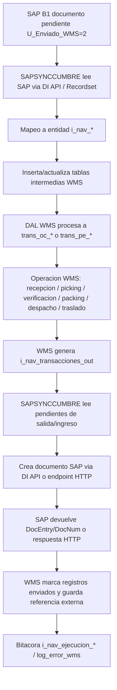
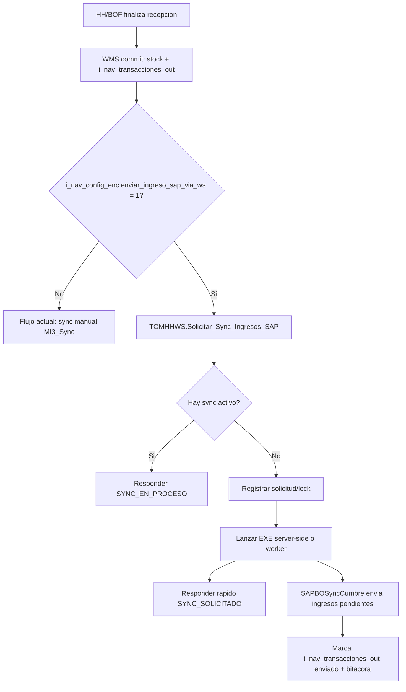
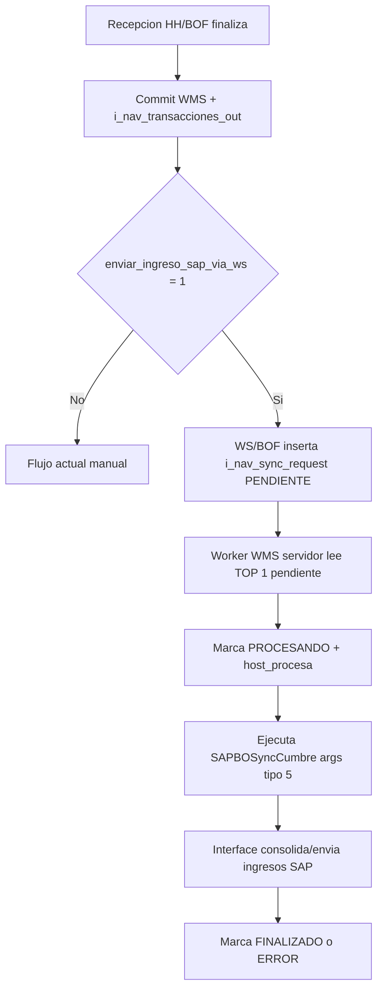
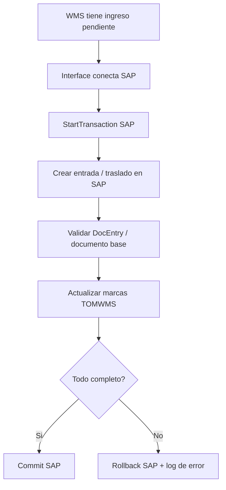

# SAPSYNCCUMBRE fine-trace operativo

Fecha: 2026-06-02  
Repo/proyecto: `SAPSYNCCUMBRE/SAPSYNCCUMBRE.vbproj`  
Assembly: `SAPBOSyncCumbre`  
Stack: VB.NET WinForms + DevExpress + SAP Business One DI API (`Interop.SAPbobsCOM`) + SQL Server WMS  
Regla de seguridad: no documentar valores de `Conn.ini` ni credenciales SAP/SQL. Solo nombres de claves y contratos.

## 1. Que es esta interface

`SAPSYNCCUMBRE` es una aplicacion WinForms/ejecutable de integracion entre SAP Business One y TOMWMS. Corre manualmente desde UI (`frmEjecucion`) o remotamente por argumentos de linea de comando. Su rol es:

- Leer maestros y documentos pendientes desde SAP B1.
- Convertirlos a entidades intermedias `i_nav_*`.
- Consolidarlos en tablas operativas WMS (`trans_oc_*`, `trans_pe_*`, tareas HH, reservas, recepcion, despacho).
- Leer las transacciones reales generadas por WMS en `i_nav_transacciones_out`.
- Crear documentos de retorno en SAP B1.
- Marcar el documento SAP o el registro WMS como enviado/procesado.
- Registrar bitacora y errores en `i_nav_ejecucion_*` y `log_error_wms`.

El proyecto no vive aislado: referencia clases compartidas bajo `TOMIMSV4/Entity` y `TOMIMSV4/DAL`. En Debug compila hacia `../TOMIMSV4/TOMIMSV4`, por lo que cambios en DAL/Entity compartidos afectan al WMS principal y a esta interface.

## 2. Arranque y seleccion de flujo

Archivo principal: `SAPSYNCCUMBRE/Clases/ModuleMain.vb`.

Entrada sin argumentos:

1. `Main(args)` llama `Init_App()`.
2. `Init_App()` exige `Conn.ini`.
3. `clsPublic.Leer_Archivo_Configuracion_Ini(IndiceInstanciaDefecto)` carga instancias.
4. `BD.Instancia` queda con conexion WMS y parametros SAP.
5. `ConfigurationManager.AppSettings("CST")` recibe la cadena SQL WMS.
6. Abre `frmMenu`.

Entrada remota con argumentos:

Formato observado:

```text
InterfaceAEjecutar-IdConfiguracion-IndiceInstancia-IdUsuario-NoDocEntrySAP-EstadoEnviadoSAP-NombreInstancia
```

El `Enum pInterfaceAEjecutar` en `Clases/m_Global.vb` define los codigos:

| Codigo | Flujo |
| --- | --- |
| 0 | Importar bodegas |
| 1 | Importar productos |
| 2 | Importar proveedores |
| 3 | Importar pedidos de compra |
| 4 | Importar pedidos/solicitudes de transferencia |
| 5 | Enviar ingresos a SAP |
| 6 | Enviar salidas/pedidos transferencia |
| 7 | Actualizar traslado como no/enviado |
| 8 | Actualizar pedido cliente como no/enviado |
| 9 | Enviar pedidos cliente SAP |
| 10 | Enviar devolucion proveedor SAP |
| 11 | Enviar traslados SAP |
| 12 | Actualizar devolucion proveedor no enviado |
| 13 | Actualizar traslados no enviado |
| 20 | Enviar ajustes inventario |
| 21 | Cerrar documento salida SAP |

`frmEjecucion_Shown` ejecuta el `Select Case Interface_A_Ejecutar` y llama la clase concreta.

## 3. Configuracion de ejecucion

Base class: `SAPSYNCCUMBRE/Clases Interface Sync/clsInterfaceBase.vb`.

Cada flujo llama:

```vb
Ejecutar_Interfaz("NombreEntidad")
```

Esto carga `i_nav_config_det` via:

```vb
clsLnI_nav_config_det.Get_All_By_IdEnc(BD.Instancia.IdConfiguracionInterface, NombreEntidad)
```

El encabezado activo viene de `i_nav_config_enc` y se expone como `BeConfigEnc`. Esa configuracion resuelve:

- Bodega WMS.
- Propietario.
- Usuario default.
- Codigos de bodega SAP.
- Parametros especiales por documento.
- Filtros por entidad (`i_nav_ent_filtros`).

## 4. Conexion SAP

Archivo: `SAPSYNCCUMBRE/Clases/m_Global.vb`.

Funciones:

- `Conectar_A_SAP`
- `Conectar_A_SAP_2017`
- `Conectar_A_SAP_2019`
- `Desconectar_SAP`

Usan SAP DI API `SAPbobsCOM.Company` con claves tomadas de `BD.Instancia`:

- `LICENSESERVER_SAP_BO`
- `SERVER_BD_SAP`
- `SAP_COMPANY_DB`
- `SAP_USR`
- `SAP_USR_PW`
- `SAP_DB_USR`
- `SAP_DB_PW`
- `SAP_DB_VERSION`

No se deben loguear valores. Solo nombres de clave.

## 5. Catalogo de documentos y objetos SAP

### Maestros SAP -> WMS

| Clase | SAP fuente | WMS destino aproximado | Marca SAP |
| --- | --- | --- | --- |
| `clsSyncSAPBodega` | `OWHS` | bodegas/clientes bodega | `U_Enviado_WMS` |
| `clsSyncSAPProducto` | `OITM` | producto, producto_bodega, presentaciones | `U_Enviado_WMS` |
| `clsSyncSAPProveedor` | `OCRD`, `OCPR` | proveedor / cliente segun flujo | `U_Enviado_WMS` |
| `clsSyncSapCodigosBarra` | SAP query de codigos | codigos barra producto | no siempre marca |
| `clsSyncSAPPresentaciones` | SAP query presentaciones | producto_presentacion | no siempre marca |
| `clsSyncSapCentrosCosto` | `[@REMARK1]` | centro_costo | `U_Enviado_WMS` compuesto |

### Documentos SAP -> WMS

| Flujo | Clase | SAP fuente | Intermedia | WMS operativo |
| --- | --- | --- | --- | --- |
| Pedido compra | `clsSyncSAPPedidoCompra` | `OPOR/POR1` | `i_nav_ped_compra_enc/det` | `trans_oc_enc/det`, recepcion HH |
| Entrada mercancia | `clsSyncSAPEntradaMercancia` | `OIGN/IGN1` | `i_nav_ped_compra_*` | `trans_oc_*` / recepcion |
| Pedido cliente / venta | `clsSyncSAPSPedidoCliente` | `ORDR/RDR1` | `i_nav_ped_traslado_enc/det` | `trans_pe_enc/det`, picking |
| Pedido traslado / solicitud | `clsSyncSAPSSolicitudTraslado` | `OWTQ/WTQ1` | `i_nav_ped_traslado_enc/det` | `trans_pe_*`, cambio ubicacion, reservas |
| Transferencia stock | `clsSyncSAPTrasladoStock` | `OWTR/WTQ1/IBT1` | `i_nav_ped_traslado_enc/det` | ingreso/salida o traslado WMS |
| Solicitud devolucion proveedor | `clsSyncSapDevolucionProveedor` | `OPRR/PRR1` | `i_nav_ped_traslado_*` | pedido salida/devolucion proveedor |
| NC/devolucion cliente | `clsSyncSAPDevolucionMeracnciaCliente` | `ORIN/RIN1` | `i_nav_ped_compra_*` | ingreso/devolucion cliente |
| Devolucion mercancia | `clsSyncSAPDevolucionMercancia` | `ORRR/RRR1` | `i_nav_ped_compra_*` o salida | ingreso/devolucion |
| Ajustes SAP | `clsSyncSAPAjustes` | `OIGN/IGN1` | `i_nav_ped_traslado_*` o `i_nav_ped_compra_*` | traslado/pedido/ingreso segun bodega |

### WMS -> SAP

| Flujo WMS terminado | Fuente WMS | Clase | SAP creado |
| --- | --- | --- | --- |
| Recepcion de OC | `i_nav_transacciones_out` con `Tipo_transaccion=INGRESO` | `clsSyncSAPPedidoCompra.Enviar_Transacciones_De_Ingreso_SAP` | `oPurchaseDeliveryNotes` contra `oPurchaseOrders` |
| Recepcion entrada mercancia | `i_nav_transacciones_out` ingreso | `clsSyncSAPEntradaMercancia.Enviar_Transacciones_De_Ingreso_SAP` | `oPurchaseDeliveryNotes` u objeto ingreso segun flujo |
| Despacho/picking/packing pedido cliente | `i_nav_transacciones_out` salida | `clsSyncSAPSPedidoCliente.Enviar_Transacciones_De_Salida` | `oDeliveryNotes` contra `oOrders` |
| Salida por pedido traslado | `i_nav_transacciones_out` salida | `clsSyncSAPPedidoTraslado.Enviar_Transacciones_De_Salida` | `oDeliveryNotes` |
| Traslado desde solicitud | `i_nav_transacciones_out` salida | `clsSyncSAPSSolicitudTraslado.Enviar_Traslados_Desde_Solicitud` | `oStockTransfer` contra `oInventoryTransferRequest` |
| Transferencia directa | `i_nav_transacciones_out` salida | `clsSyncSAPSSolicitudTraslado.Enviar_Transferencia_Stock_SAP` | `oStockTransfer` |
| Devolucion proveedor | `i_nav_transacciones_out` salida | `clsSyncSAPSSolicitudTraslado.Enviar_Solicitud_Devolucion_Proveedor_SAP` | `oGoodsReturnRequest` |
| Ajustes inventario | vistas/pendientes de ajustes | `clsSyncAjusteInventario.Sync_Ajustes` | HTTP endpoint Cumbre `URL_ENTRADA_AJUSTE_POST` / `URL_SALIDA_AJUSTE_POST` |

## 6. Fine-trace SAP -> WMS: documentos entrantes

### 6.1 Pedido de compra

Entrada:

1. UI/remoto llama `Ejecuta_Interface_Pedidos_Compra_SAP`.
2. `clsSyncSAPPedidoCompra.Ejecutar_Interfaz("Pedido compra")`.
3. `Get_Pedidos_Compra_From_SAP` consulta `OPOR` con:
   - `DOCSTATUS='O'`
   - `CANCELED='N'`
   - `U_Enviado_WMS=2`
   - filtro opcional por `DocNum`
   - bodega tomada de `POR1.WhsCode`
4. Detalle desde `POR1` + `OITM`.
5. Mapea a `clsBeI_nav_ped_compra_enc/det`.
6. Inserta/actualiza `i_nav_ped_compra_enc/det`.
7. `Procesar_Pedido_Compra_MI3` crea o actualiza `trans_oc_enc/det`.
8. Se marca SAP con `U_Enviado_WMS = 1` via `Marcar_PI_Sincronizado_SAP`.

Uso WMS:

- La OC queda disponible para recepcion.
- HH recepcion consume `trans_oc_*`/`trans_re_*`.
- Al recibir fisicamente, WMS genera `i_nav_transacciones_out` de ingreso.

### 6.2 Pedido cliente / orden venta

Entrada:

1. UI/remoto ejecuta `Importar_Pedido_Cliente_SAP` o flujo de salida relacionado.
2. `Get_Pedidos_Cliente_SAP` consulta `ORDR/RDR1`.
3. Filtro principal: `DocStatus='O'`, `U_Enviado_WMS=2`.
4. Encabezado mapea:
   - `DocEntry` como `No`
   - `DocNum` como `Receipt_Document_Reference`
   - `CardCode/CardName` como cliente destino
   - bodega desde `RDR1.WhsCode`
5. Detalle mapea producto, cantidad, linea, unidad, bodega.
6. `clsLnI_nav_ped_traslado_enc.Importar_Pedido_Cliente_A_Tabla_Intermedia_If` crea `trans_pe_enc/det`.
7. Si aplica, crea manufactura por defecto.
8. Se marca `U_EnviadoWMS`/`U_Enviado_WMS` en SAP como enviado.

Uso WMS:

- El pedido queda listo para reserva/picking.
- HH picking/verificacion/packing/despacho operan sobre `trans_pe_*`, `stock_res`, `trans_picking_*`, `trans_packing_*`, `trans_despacho_*`.
- Al despachar, se consolidan salidas en `i_nav_transacciones_out`.

### 6.3 Solicitud de traslado

Entrada:

1. `Ejecuta_interface_Traslados_SAP` o `Ejecuta_interface_Traslados_Entrada_SAP`.
2. `clsSyncSAPSSolicitudTraslado`.
3. Consulta `OWTQ/WTQ1/OWHS`.
4. Filtros:
   - `T0.DocStatus='O'`
   - `T0.U_Enviado_WMS=2`
   - bodega origen/destino por `i_nav_ent_filtros`
   - opcional por `DocNum`
5. Mapea a `i_nav_ped_traslado_enc/det`:
   - origen: `FromWhsCod`
   - destino: `WhsCode`
   - `U_ALMDEST` como campo destino adicional
   - `Document_Type = Traslado_Por_Estados_SAP`
6. Procesa a WMS:
   - si es salida: genera `trans_pe_*` y reserva/picking.
   - si es entrada: genera orden de ingreso/recepcion.
   - si es traslado interno: puede derivar en cambio de ubicacion/tarea HH.
7. Marca SAP `U_Enviado_WMS = 1`.

### 6.4 Devoluciones / NC

Familias:

- `clsSyncSapDevolucionProveedor`: lee `OPRR/PRR1`, solicitud de devolucion proveedor.
- `clsSyncSAPDevolucionMeracnciaCliente`: lee `ORIN/RIN1`, nota credito/devolucion cliente.
- `clsSyncSAPDevolucionMercancia`: lee `ORRR/RRR1`, solicitud devolucion cliente/mercancia.

Patron:

1. Leer documento SAP pendiente `U_Enviado_WMS = 2`.
2. Asegurar socio/proveedor/cliente en WMS si no existe.
3. Mapear a intermedia de ingreso o salida segun naturaleza.
4. Crear `trans_oc_*` para ingreso/devolucion cliente o `trans_pe_*` para salida/devolucion proveedor.
5. Marcar SAP enviado.

## 7. Fine-trace WMS -> SAP: documentos salientes

### 7.1 Consolidacion WMS

Tabla pivote: `i_nav_transacciones_out`.

Entidad: `TOMIMSV4/Entity/Interface/Transacciones_Out/clsBeI_nav_transacciones_out.vb`.

Campos operativos importantes:

- IDs de contexto: `Idordencompra`, `Idrecepcionenc`, `Idpedidoenc`, `Iddespachoenc`.
- Producto/lote: `Idproducto`, `Codigo_producto`, `Lote`, `Fecha_vence`, `Lic_Plate`.
- Cantidades: `Cantidad`, `Cantidad_Esperada`, `Cantidad_Enviada`, `Cantidad_Pendiente`.
- Documento origen SAP: `No_pedido`, `No_linea`.
- Tipo: `Tipo_transaccion`, `IdTipoDocumento`.
- Estado: `Enviado`, `Auditar`.
- Transporte/fiscal: `Empresa_Transporte`, `Piloto_Transporte`, `Placa_Transporte`, `Marchamo_No`, valores aduana/fob/iva/dai/flete.
- Bodegas: `Codigo_Bodega_Origen`, `Codigo_Bodega_Destino`.

Insercion de ingresos:

- `clsLnI_nav_transacciones_out.Insertar_Ingreso`.
- Llamado desde procesos de recepcion cuando se confirma detalle recibido.
- Registra por linea/lote/licencia lo que debe viajar a SAP.

Insercion de salidas:

- Se genera desde procesos de pedido/despacho/picking/packing segun flujo operativo.
- Las clases SAP leen pendientes con metodos tipo `Get_Lotes_Salida_Pendientes_Envio`.

Regla: SAP no se alimenta directamente desde pantallas HH; se alimenta desde la consolidacion WMS en `i_nav_transacciones_out`.

### 7.2 Enviar ingresos SAP

Entry point:

- `frmEjecucion.Enviar_Pedidos_Compra`
- `clsSyncSAPPedidoCompra.Enviar_Transacciones_De_Ingreso_SAP`

Trace:

1. Lee `i_nav_transacciones_out` pendientes de ingreso.
2. Agrupa por `No_pedido`/OC SAP.
3. Verifica tipo documento WMS (`trans_oc_ti`) y relacion recepcion/OC (`trans_re_oc`).
4. Abre SAP DI API.
5. Carga `oPurchaseOrders` por `DocEntry`.
6. Crea `oPurchaseDeliveryNotes`.
7. Por cada linea:
   - `BaseType = PurchaseOrder`
   - `BaseEntry = DocEntry OC`
   - `BaseLine = LineNum OC`
   - `WarehouseCode` segun configuracion/bodega.
   - Batch/lote si aplica (`BatchNumbers` con lote, cantidad, vencimiento, licencia).
8. `oEntrega.Add()`.
9. Si SAP devuelve OK, obtiene `GetNewObjectCode`.
10. Marca `i_nav_transacciones_out.Enviado = 1`.
11. Actualiza documento WMS con `No_Documento_Externo` cuando aplica.

### 7.3 Enviar salida pedido cliente

Entry point:

- `frmEjecucion.Enviar_Documentos_Salida`
- `clsSyncSAPSPedidoCliente.Enviar_Transacciones_De_Salida`

Trace:

1. Lee lotes de salida pendientes.
2. Agrupa por `No_pedido` (`DocEntry` SAP).
3. Verifica si WMS ya marco estado enviado a ERP.
4. Carga `oOrders`.
5. Crea `oDeliveryNotes`.
6. Por linea:
   - `BaseType = Orders`
   - `BaseEntry = DocEntry pedido`
   - `BaseLine = linea SAP`
   - cantidad despachada WMS.
   - lote/licencia/vencimiento si aplica.
7. `oEntrega.Add()`.
8. Marca registros WMS enviados.
9. Marca/actualiza estado SAP si corresponde.

### 7.4 Enviar traslado desde solicitud

Entry point:

- `frmEjecucion.Enviar_Traslado_Desde_Solicitud`
- `clsSyncSAPSSolicitudTraslado.Enviar_Traslados_Desde_Solicitud`

Trace:

1. Lee `i_nav_transacciones_out` con `IdTipoDocumento = Traslado_Por_Estados_SAP`.
2. Agrupa por pedido/solicitud y bodegas.
3. Carga `oInventoryTransferRequest`.
4. Crea `oStockTransfer`.
5. Usa origen/destino:
   - `FromWarehouse`
   - `ToWarehouse`
   - `Lines.FromWarehouseCode`
   - `Lines.WarehouseCode`
6. Si viene de solicitud:
   - `BaseType = InventoryTransferRequest`
   - `BaseEntry = DocEntry solicitud`
   - `BaseLine = linea solicitud`
7. Agrega lotes si aplica.
8. `oTransfer.Add()`.
9. Obtiene `DocEntry/DocNum` de `OWTR`.
10. Actualiza WMS (`No_Documento_Externo`) y marca pendientes enviados.

### 7.5 Enviar devolucion proveedor

Entry point:

- `frmEjecucion.Enviar_Solicitud_Devolucion_Proveedor`
- `clsSyncSAPSSolicitudTraslado.Enviar_Solicitud_Devolucion_Proveedor`

Trace:

1. Lee pendientes `IdTipoDocumento = Devolucion_Proveedor`.
2. Obtiene `trans_pe_enc` por `IdPedidoEnc`.
3. Crea `oGoodsReturnRequest`.
4. Cabecera:
   - `CardCode = Cliente/Proveedor del pedido`
   - `Comments = IdPedidoEnc`
   - `JournalMemo = IdPedidoEnc`
   - user fields `U_tiedest`, `U_Causas_dev`.
5. Lineas por producto/cantidad.
6. `Add()`.
7. Actualiza `No_Documento_Externo` en pedido WMS.
8. Marca registros enviados.

### 7.6 Ajustes inventario

Entry point:

- `frmEjecucion.Enviar_Ajustes`
- `clsSyncAjusteInventario.Sync_Ajustes`

Particularidad:

- Ademas de DI API, existen endpoints HTTP configurados por claves:
  - `URL_ENTRADA_AJUSTE_POST`
  - `URL_SALIDA_AJUSTE_POST`
- La clase de solicitud traslado tambien contiene validacion HTTP `Validata_Productos_EndPointCumbre`.

Trace esperado:

1. Lee ajustes WMS pendientes.
2. Clasifica entrada/salida.
3. Serializa payload JSON cuando usa endpoint Cumbre.
4. Hace POST al endpoint correspondiente.
5. Interpreta respuesta.
6. Marca WMS como enviado o registra error.

## 8. Bitacora y control de errores

Tablas/clases:

- `i_nav_ejecucion_enc`
- `i_nav_ejecucion_det_error`
- `i_nav_ejecucion_res`
- `log_error_wms`

Patron:

- Cada clase llama `Ejecutar_Interfaz("Entidad")` para cargar configuracion.
- Durante procesamiento se llama `clsPublic.Actualizar_Progreso(lblprg, ...)`.
- Errores de documento se registran con `clsLnI_nav_ejecucion_det_error.Inserta_Log(...)`.
- Eventos operativos relevantes tambien se registran en `clsLnLog_error_wms.Agregar_Error(...)`.

## 9. Workflow completo de ida y vuelta WMS



## 10. Riesgos y puntos de control

1. `U_EnviadoWMS` vs `U_Enviado_WMS`: el codigo usa ambas variantes segun objeto SAP. Validar campos de usuario instalados por cliente.
2. `DocEntry` vs `DocNum`: hay comentarios recientes de cambio; varias rutinas guardan `DocEntry` como `No` y `DocNum` como referencia visible. No invertirlos sin revisar cada clase.
3. Rutas compartidas: `SAPSYNCCUMBRE` depende de `TOMIMSV4/DAL` y `TOMIMSV4/Entity`; un cambio local puede impactar WMS principal.
4. Lotes/licencias: la salida a SAP usa `BatchNumbers`; revisar `Lote`, `Fecha_vence`, `Lic_Plate` antes de cerrar problemas de envio.
5. Idempotencia: el contrato principal de no duplicar es `U_Enviado*_WMS` en SAP y `Enviado` en `i_nav_transacciones_out`.
6. Transacciones parciales: si SAP acepta documento pero WMS falla al marcar enviado, queda riesgo de duplicado en siguiente corrida.
7. Configuracion por entidad: `i_nav_config_det` y `i_nav_ent_filtros` cambian el set de documentos por bodega/fecha/tipo.
8. No exponer secretos: `Conn.ini` contiene valores sensibles y no debe copiarse a reportes.

## 11. Checklist para diagnostico

Para un documento que no entra desde SAP:

1. Identificar tipo SAP: `OPOR`, `ORDR`, `OWTQ`, `OWTR`, `OPRR`, `ORIN`, `OIGN`.
2. Confirmar campo `U_Enviado*_WMS = 2`.
3. Confirmar `DocStatus='O'` y no cancelado.
4. Confirmar filtro de bodega en `i_nav_ent_filtros`.
5. Revisar `i_nav_ped_compra_*` o `i_nav_ped_traslado_*`.
6. Revisar `trans_oc_*` o `trans_pe_*`.
7. Revisar `i_nav_ejecucion_det_error` y `log_error_wms`.

Para un documento que no sale de WMS a SAP:

1. Confirmar operacion WMS cerrada.
2. Confirmar registros en `i_nav_transacciones_out` con `Enviado = 0`.
3. Confirmar `Tipo_transaccion` e `IdTipoDocumento`.
4. Confirmar agrupacion por `No_pedido` y linea.
5. Confirmar lotes/licencias/cantidades.
6. Ejecutar flujo correspondiente en `frmEjecucion` o por argumento remoto.
7. Si SAP creo documento pero WMS no marco enviado, revisar `GetNewObjectCode`, `No_Documento_Externo` y bitacoras.

## 12. Entry-points por clase

| Clase | Entry points principales |
| --- | --- |
| `clsSyncSAPBodega` | `Insertar_Bodegas_Desde_Tabla_Intermedia_A_Tabla_TOMWMS`, `Insertar_Bodegas_Desde_SAP` |
| `clsSyncSAPProducto` | `Insertar_Productos_Desde_Tabla_Intermedia_A_Tabla_TOMWMS`, `Importar_Productos_Desde_SAP_A_TablaIntermedia` |
| `clsSyncSAPProveedor` | `Insertar_Proveedores_Desde_Tabla_Intermedia_A_Tabla_TOMWMS`, `Importar_Proveedores_Desde_SAP_A_TablaIntermedia` |
| `clsSyncSAPPedidoCompra` | `Get_Pedidos_Compra_From_SAP`, `Insertar_Pedidosdecompra_Desde_Tabla_Intermedia_A_Tabla_TOMWMS`, `Enviar_Transacciones_De_Ingreso_SAP` |
| `clsSyncSAPSPedidoCliente` | `Get_Pedidos_Cliente_SAP`, `Procesar_Pedidos_Cliente_SAP`, `Enviar_Transacciones_De_Salida` |
| `clsSyncSAPSSolicitudTraslado` | `Get_Solicitudes_Traslado_SAP`, `Importar_Solicitud_Traslado_SAP`, `Enviar_Traslados_Desde_Solicitud`, `Enviar_Solicitud_Devolucion_Proveedor` |
| `clsSyncSAPTrasladoStock` | `Get_Traslados_SAP`, `Importar_Trasladados_SAP`, `Enviar_Transacciones_De_Salida` |
| `clsSyncSapDevolucionProveedor` | `Get_Devolucion_Proveedor_From_SAP`, `Procesar_Devolucion_Mercancia_SAP` |
| `clsSyncSAPDevolucionMeracnciaCliente` | `Get_Notas_Credito_From_SAP`, `Insertar_NC_Cliente_Desde_Tabla_Intermedia_A_Tabla_TOMWMS` |
| `clsSyncSAPDevolucionMercancia` | `Get_Solicitud_Devolucion_From_SAP`, `Insertar_Solicitud_Devol_Cli_A_TOMWMS`, `Enviar_Entrada_Mercancia_Por_Estado_SAP_B1` |
| `clsSyncAjusteInventario` | `Sync_Ajustes` |

## 13. Preguntas abiertas para validar con Erik

1. Confirmar en Cumbre productivo que `U_Enviado_WMS = 2` significa pendiente y `1` enviado para todos los objetos, incluyendo variantes sin guion.
2. Confirmar si `SAPSYNCCUMBRE` debe documentarse como reemplazo de `SAPSYNCMAMPA` o fork especifico por cliente.
3. Confirmar si ajustes inventario deben ir siempre por endpoint HTTP o si existe fallback DI API por escenario.
4. Confirmar scheduler externo que lanza argumentos remotos y frecuencia por codigo de interface.
5. Confirmar si el repo local debe actualizarse contra los 10 commits remotos antes de hacer cambios funcionales.

## 14. Modelo propuesto: Solicitar_Sync_Ingresos_SAP via WebService

Objetivo: habilitar sincronizacion de ingresos SAP bajo demanda desde WSHHRN/TOMHHWS sin cambiar el flujo actual. El comportamiento actual se conserva por defecto.

### 14.1 Flag de configuracion

DDL propuesto:

```sql
ALTER TABLE dbo.i_nav_config_enc
ADD enviar_ingreso_sap_via_ws bit NOT NULL
    CONSTRAINT DF_i_nav_config_enc_enviar_ingreso_sap_via_ws DEFAULT (0);
```

Contrato:

- `0`: flujo actual. La recepcion genera `i_nav_transacciones_out`; el usuario sincroniza manualmente desde MI3_Sync/SAPSYNCCUMBRE.
- `1`: al cerrar una recepcion, BOF/HH puede solicitar al WebService que dispare el envio de ingresos SAP.

Implementacion Fase 1 aplicada localmente el 2026-06-02:

- `TOMIMSV4/Entity/Interface/Configuracion/ConfiguracionEncabezado/clsBeI_nav_config_enc.vb`
  - Propiedad `Enviar_Ingreso_SAP_Via_WS As Boolean = False`.
- `TOMIMSV4/DAL/Interface/Configuracion/ConfiguracionEncabezado/clsLnI_nav_config_enc.vb`
  - `Cargar` mapea `enviar_ingreso_sap_via_ws` con default `False` y guard de columna para despliegue por fases.
  - `Insertar`/`Actualizar` persisten `enviar_ingreso_sap_via_ws`.
- `TOMIMSV4/TOMIMSV4/Mantenimientos/Configuracion_Interface/frmConfiguracion.vb`
  - Mapeo preparado sin tocar Designer. Al agregar el campo visual, usar `CheckEdit` con nombre `chkSapSyncEnviaIngresosAuto`.
- Repo DBA `ejcalderongt/DBA`
  - `i_nav_config_enc`: script idempotente para agregar `enviar_ingreso_sap_via_ws`.
  - `i_nav_sync_request`: script idempotente para crear la tabla e indices del worker.

### 14.2 WebMethod sugerido

Nombre:

```vb
Solicitar_Sync_Ingresos_SAP(pIdBodega As Integer,
                            pIdEmpresa As Integer,
                            pIdUsuario As Integer,
                            Optional pIdRecepcionEnc As Integer = 0,
                            Optional pOrigen As String = "HH") As String
```

Respuesta sugerida Forma A JSON:

```json
{
  "Error": false,
  "Codigo": "SYNC_SOLICITADO",
  "Mensaje": "Sincronizacion de ingresos SAP solicitada.",
  "TraceId": "...",
  "SyncId": 123,
  "Estado": "SOLICITADO"
}
```

Codigos sugeridos:

- `SYNC_DESHABILITADO`: flag apagado; conservar flujo manual.
- `SYNC_SOLICITADO`: solicitud aceptada.
- `SYNC_EN_PROCESO`: ya existe ejecucion activa para la configuracion.
- `SYNC_SIN_PENDIENTES`: no hay ingresos pendientes en `i_nav_transacciones_out`.
- `SYNC_NO_CONFIG`: no existe `i_nav_config_enc` para bodega/empresa.
- `SYNC_EXE_NO_CONFIGURADO`: no hay ruta server-side configurada.
- `SYNC_EXE_NO_EXISTE`: el binario no existe en la ruta del servidor.
- `SYNC_ERROR`: fallo no controlado.

### 14.3 Donde engancha HH/BOF

No debe reemplazar la escritura de `i_nav_transacciones_out`.

Punto correcto:

1. Recepcion se finaliza normalmente.
2. La transaccion WMS confirma `trans_re_*`, stock y `i_nav_transacciones_out`.
3. Despues del commit, si `enviar_ingreso_sap_via_ws = 1`, se llama `Solicitar_Sync_Ingresos_SAP`.
4. HH/BOF solo muestra mensaje no bloqueante:
   - "Recepcion finalizada. Sync SAP solicitado."
   - Si falla el disparo: "Recepcion finalizada. Sync SAP pendiente/manual."

Regla clave: no hacer que el exito de recepcion dependa del exito de SAP.

### 14.4 Problema ClickOnce y ruta del ejecutable

No se debe ejecutar el EXE del cliente ClickOnce desde IIS.

Motivos:

- ClickOnce instala por usuario, en rutas tipo `%LOCALAPPDATA%\Apps\2.0\...`.
- El AppPool del WebService normalmente corre con otra identidad.
- IIS no tiene perfil interactivo ni permisos para esa ruta.
- WinForms/DevExpress puede intentar inicializar UI en una sesion no interactiva.
- `Conn.ini`, DLL DI API y dependencias SAP pueden no existir en esa ubicacion.

Requisito para que el WebService ejecute la interface:

1. Instalar una copia **server-side** de `SAPBOSyncCumbre.exe` fuera de ClickOnce, por ejemplo:
   - `C:\TOMWMS\Interfaces\SAPSYNCCUMBRE\SAPBOSyncCumbre.exe`
2. Copiar junto al EXE:
   - `Conn.ini` del servidor.
   - DLLs requeridas (`Interop.SAPbobsCOM.dll`, DevExpress, Entity/DAL/AppGlobal compatibles).
   - `Newtonsoft.Json.dll` y dependencias.
3. Instalar SAP DI API en el servidor donde corre IIS.
4. Dar permisos al usuario del AppPool:
   - Read/execute sobre carpeta de interface.
   - Read sobre `Conn.ini`.
   - Write sobre carpeta de logs si se agrega log file.
   - Permiso de red hacia SQL WMS y SAP.
5. Configurar la ruta en una tabla/configuracion server-side, no hardcodeada.

Parametro de ejecucion para ingresos:

```text
5-IdConfiguracion-IndiceInstancia-IdUsuario-0-0-NombreInstancia
```

`5` corresponde a `Enviar_Pedidos_Compra`.

### 14.5 Opcion recomendada: WebService como solicitador, no como ejecutor bloqueante

Patron recomendado:



El WebService no debe esperar a que SAP termine. Debe responder rapido y dejar trazabilidad.

### 14.6 Control de concurrencia minimo

Antes de lanzar el EXE:

- Buscar ejecucion activa por `IdNavConfigEnc` y tipo `Enviar_Pedidos_Compra`.
- Si existe proceso activo o lock reciente, devolver `SYNC_EN_PROCESO`.
- Si no existe, crear lock/registro de solicitud.

Opciones:

- Tabla nueva `i_nav_sync_request` / `i_nav_sync_lock`.
- Reutilizar `i_nav_ejecucion_enc` solo si permite estado activo claro.
- Mutex por nombre en servidor, ejemplo conceptual: `Global\TOMWMS_SAP_SYNC_INGRESOS_{IdNavConfigEnc}`.

Recomendacion: tabla de lock + validacion de proceso, para que quede auditable desde WMS.

### 14.7 Alternativas tecnicas

Opcion A - WebService lanza EXE server-side:

- Menor cambio.
- Riesgo medio por `Process.Start` desde IIS.
- Requiere instalacion server-side estable.

Opcion B - WebService inserta solicitud y un worker externo la procesa:

- Mas robusto.
- El worker puede ser tarea programada cada minuto o consola residente.
- IIS no necesita permisos DI API ni ejecutar WinForms.
- Mejor para produccion.

Opcion C - Mover logica de `Enviar_Transacciones_De_Ingreso_SAP` a libreria/servicio sin UI:

- Arquitectura mas limpia.
- Mayor refactor.
- Evita WinForms en servidor.
- Requiere separar dependencias de `frmEjecucion`, progreso visual y DI API.

Para "sin cambiar flujo actual", empezar por opcion B o A controlada.

### 14.8 Fase 2 acordada: worker WMS ejecuta la interface SAP

Decision de diseno 2026-06-02:

- El WebService no debe ejecutar directamente `SAPBOSyncCumbre.exe`.
- El WebService/BOF debe registrar una solicitud liviana.
- El WMS que queda abierto en servidor procesa esa solicitud y ejecuta la interface SAP desde la ruta donde ya viajan EXE, DLL e INI.

Tabla sugerida `i_nav_sync_request`:

```sql
CREATE TABLE dbo.i_nav_sync_request (
    idsyncrequest bigint IDENTITY(1,1) NOT NULL PRIMARY KEY,
    idnavconfigenc int NOT NULL,
    idempresa int NOT NULL,
    idbodega int NOT NULL,
    idusuario int NOT NULL,
    tipo_interface int NOT NULL,
    origen varchar(30) NOT NULL,
    estado varchar(20) NOT NULL,
    parametros nvarchar(max) NULL,
    fecha_solicitud datetime NOT NULL CONSTRAINT DF_i_nav_sync_request_fecha_solicitud DEFAULT (GETDATE()),
    fecha_inicio datetime NULL,
    fecha_fin datetime NULL,
    intento int NOT NULL CONSTRAINT DF_i_nav_sync_request_intento DEFAULT (0),
    mensaje nvarchar(1000) NULL,
    host_solicita varchar(100) NULL,
    host_procesa varchar(100) NULL
);
```

Implementacion DAL/Entity aplicada localmente:

- `TOMIMSV4/Entity/Interface/SyncRequest/clsBeI_nav_sync_request.vb`
  - Entity con ejemplos por campo, constantes de estados/origen y `ICloneable`.
- `TOMIMSV4/DAL/Interface/SyncRequest/clsLnI_nav_sync_request.vb`
  - `Insertar`: crea la solicitud y devuelve `idsyncrequest`.
  - `Existe_Solicitud_Activa`: evita duplicar `PENDIENTE`/`PROCESANDO` por configuracion y tipo.
  - `Encolar_Si_No_Existe_Activa`: metodo minimo para WS/BOF.
  - `Tomar_Siguiente_Pendiente`: metodo minimo para worker WMS con `UPDLOCK`, `READPAST`, `ROWLOCK`.
  - `Marcar_Procesando`, `Marcar_Finalizado`, `Marcar_Error`, `Marcar_Ignorado`: ciclo de vida del worker.
- Repo DBA `ejcalderongt/DBA`
  - `i_nav_sync_request`: DDL idempotente de la tabla e indices de lectura por estado/configuracion.

Estados minimos:

- `PENDIENTE`: solicitud creada, aun no tomada por worker.
- `PROCESANDO`: worker tomo el registro y ejecuta EXE/interface.
- `FINALIZADO`: interface termino sin error controlado.
- `ERROR`: fallo al ejecutar o la interface reporto error.
- `IGNORADO`: no habia pendientes reales o ya existia solicitud equivalente.

Parametros a guardar:

```json
{
  "interface": "SAPSYNCCUMBRE",
  "tipoInterface": 5,
  "accion": "Enviar_Pedidos_Compra",
  "args": "5-IdConfiguracion-IndiceInstancia-IdUsuario-0-0-NombreInstancia",
  "idRecepcionEnc": 0,
  "trigger": "RecepcionFinalizada",
  "flag": "i_nav_config_enc.enviar_ingreso_sap_via_ws"
}
```

Regla para evitar overhead a BD:

- El cierre de recepcion hace un solo `INSERT`/upsert de solicitud despues del commit.
- El worker consulta por `TOP 1 estado='PENDIENTE'` cada 30-60 segundos, con indice por `(estado, fecha_solicitud)`.
- Antes de insertar, validar que no exista `PENDIENTE`/`PROCESANDO` para el mismo `idnavconfigenc` y `tipo_interface=5`.
- No escanear `i_nav_transacciones_out` constantemente desde WMS. Esa tabla se valida solo al crear solicitud o dentro de la interface existente.

Workflow Fase 2:



Puntos de implementacion futura:

- BOF/WS: metodo `Solicitar_Sync_Ingresos_SAP` solo encola, no bloquea recepcion.
- WMS BOF servidor: timer/worker con mutex local para no lanzar dos interfaces simultaneas.
- Interface: reutilizar `Enviar_Pedidos_Compra` sin cambiar reglas de consolidacion actual.
- HH: sin cambio obligatorio; solo opcional si se quiere mostrar estado de sync.

## 15. Evaluacion 2026-06-02: blindaje transaccional Cumbre/Killios

Problemas reportados:

1. En La Cumbre, al enviar ingresos SAP, si SAP crea el documento pero luego falla la actualizacion local de WMS, `i_nav_transacciones_out` queda no enviado y el documento se reintenta, pudiendo duplicarse en SAP.
2. No se valida de forma consistente si el documento ya existe en SAP antes de reintentar.
3. A veces no se genera la solicitud/traslado hacia la bodega destino (ej. 05 -> Coloniales), comportamiento observado tambien en Killios.

Comparacion tecnica:

- `SAPSYNC_Killios/Clases/clsSAPTransaction.vb` encapsula `Company.StartTransaction` y `Company.EndTransaction(wf_Commit/wf_RollBack)`.
- `SAPSYNC_Killios/Clases Interface Sync/Pedido_Compra/clsSyncSAPPedidoCompra.vb` procesa cada documento con transaccion SAP + `clsTransaccion` SQL, y en error hace rollback de ambos.
- `SAPSYNC_Killios/Clases Interface Sync/Solicitud_Traslado/clsSyncSAPSSolicitudTraslado.vb` valida post-condiciones: obtiene el DocEntry generado, valida `GetByKey`, actualiza referencias WMS, genera solicitud hacia bodega destino si aplica, valida que exista `No_Pase`, y solo despues marca `i_nav_transacciones_out` como enviado.
- `SAPSYNCCUMBRE/Clases Interface Sync/Pedido_Compra/clsSyncSAPPedidoCompra.vb` inicia una transaccion SQL al comienzo de `Enviar_Transacciones_De_Ingreso_SAP`, pero los metodos internos conectan a SAP directamente y no envuelven `Add/Update/Close` en una transaccion SAP. Ademas hay actualizaciones WMS/SAP dispersas dentro de metodos internos.

Hipotesis RCA:

- El duplicado nace por una ventana no atomica: SAP confirma documento, luego falla WMS al marcar enviado/referencia; el siguiente ciclo ve `enviado = 0` y lo vuelve a enviar.
- La validacion de existencia en SAP sigue siendo necesaria aunque se agregue transaccionalidad, porque cubre reintentos despues de cortes de red, errores al obtener `GetNewObjectCode`, ejecuciones antiguas y estados heredados donde el documento ya existe.
- La falta de solicitud hacia bodega destino ocurre cuando el flujo de traslado intermedio no verifica como post-condicion obligatoria que exista el documento destino (`No_Pase`/referencia) para tipos que lo requieren.

Blindaje recomendado:

1. Agregar a SAPSYNCCUMBRE helper equivalente a `clsSAPTransaction`.
2. Cambiar el procesamiento por documento, no por lote completo: cada grupo `No_pedido/IdOrdenCompra/IdRecepcionEnc/IdBodega` debe abrir SAP transaction + SQL transaction, ejecutar, validar post-condiciones y confirmar ambos.
3. Orden canonico de commit:
   - Crear/actualizar documento SAP.
   - Obtener `DocEntry`/`DocNum` y validar `GetByKey`.
   - Actualizar WMS con referencias SAP y banderas locales dentro de SQL transaction.
   - Validar post-condiciones WMS (`i_nav_transacciones_out` marcado, `trans_oc_enc.Enviado_A_ERP`, `trans_re_oc.No_docto`).
   - Si tipo requiere bodega destino, validar que se genero solicitud/traslado destino.
   - Commit SAP y commit SQL.
4. En error: rollback SAP si la transaccion esta activa y rollback SQL. Registrar error con documento, idrecepcion, idordencompra, tipo, DocEntry SAP si se alcanzo a obtener.
5. Agregar validacion idempotente antes de enviar:
   - Si WMS ya tiene referencia SAP (`No_docto`, `No_Documento_Externo`, `No_Picking_ERP` segun flujo), validar en SAP con `GetByKey`.
   - Si existe en SAP y corresponde al documento WMS, marcar local como enviado sin crear nuevo documento.
   - Si existe en SAP pero no corresponde, bloquear con error de integridad.
6. Blindar bodega destino:
   - Definir helper `Tipo_Ingreso_Requiere_Solicitud_Destino`.
   - Si el tipo requiere solicitud destino y `Bodega_Destino`/cliente destino esta vacio, fallar antes de tocar SAP.
   - Despues de crear traslado/intermedio, exigir `Get_No_Pase_By_IdDespachoEnc <> 0` o referencia equivalente. Si no existe, lanzar excepcion para rollback.

Fase de implementacion sugerida:

- Fase A: portar `clsSAPTransaction` a `SAPSYNCCUMBRE` y envolver `Enviar_Transacciones_De_Ingreso_SAP` por documento.
- Fase B: agregar validadores idempotentes de existencia SAP para ingreso/traslado.
- Fase C: post-condiciones de bodega destino por tipo de documento.
- Fase D: pruebas con documento de ingreso normal, devolucion, transferencia de ingreso y caso 05 -> Coloniales.

## 16. Cambio aplicado 2026-06-02: blindaje transaccional Cumbre con referencia Killios

Resumen humano para Carol:

Erik detecto que La Cumbre podia quedarse partida entre SAP y TOMWMS. En palabras simples: SAP recibia la entrada de mercancia, pero si luego TOMWMS fallaba al marcar el documento como enviado, para TOMWMS el documento seguia pendiente. En el siguiente sync, la interface lo podia volver a mandar. Killios ya tenia una proteccion para esto: abrir una transaccion en SAP, hacer el trabajo, validar las marcas y confirmar solo cuando el paquete completo esta bien. Ese patron se llevo a Cumbre para que SAP no quede confirmado si WMS no alcanzo a cerrar su parte.

Archivos tocados:

- `SAPSYNCCUMBRE/Clases/clsSAPTransaction.vb`
  - Nuevo helper equivalente al de Killios.
  - Envuelve `Company.StartTransaction()` y `Company.EndTransaction(wf_Commit/wf_RollBack)`.
  - Tag inline: `#EJC20260602_SYNC_INGRESO_SAP`.
- `SAPSYNCCUMBRE/SAPSYNCCUMBRE.vbproj`
  - Incluye `Clases\clsSAPTransaction.vb` en el build de la interface.
- `SAPSYNCCUMBRE/Clases Interface Sync/Pedido_Compra/clsSyncSAPPedidoCompra.vb`
  - `Enviar_Transacciones_De_Ingreso_SAP` ahora cierra explicitamente la transaccion SQL del barrido.
  - `Enviar_Entrada_Mercancia_OC_SAP` abre transaccion SAP antes de crear entrada/actualizar/cerrar OC y hace commit solo al final.
  - Si falla la entrada, el update/cierre de OC o una marca local dentro de ese paquete, se ejecuta rollback SAP.
  - Antes de crear una entrada nueva, valida si `trans_re_oc.No_Erp_Docentry_Entrega` ya existe en SAP. Si existe y coincide con el DocNum guardado, no vuelve a crear; permite reconciliar la marca local.
  - Despues de crear entrada de mercancia, valida el DocEntry con `GetByKey` y guarda `No_Erp_Docentry_Entrega` / `No_Erp_Docnum_Entrega` en `trans_re_oc`.
  - `Enviar_Entrada_Mercancia_Teorica_SAP` acepta `pUsarConexionSAPActual` para no desconectar SAP cuando la llama el flujo protegido por la transaccion externa.
  - `Enviar_Solicitud_Traslado_SAP` inicia transaccion SAP, valida que haya lineas WMS a actualizar, valida que el DocEntry creado exista en SAP con `GetByKey` y solo despues marca WMS.
  - Se corrigio la validacion de conexion en traslado para revisar `lErrCode`, que es el parametro usado en esa llamada.

Por que mejora contra el problema de duplicados:



Antes, el paso `D` podia quedar firme aunque `F` fallara. Ahora, si `F` falla, SAP no confirma el documento y el reintento no duplica una entrada que ya habia quedado viva.

Que se agrego para la pregunta de existencia en SAP:

Carol, la transaccion ayuda mucho, pero no responde todos los casos. Si un documento ya venia de una ejecucion anterior o si el corte ocurrio despues de que SAP entrego el DocEntry, necesitamos una forma de reconocerlo. Por eso ahora la entrada guarda la referencia real de SAP en `trans_re_oc` y, antes de crear otra entrada, revisa esa referencia contra SAP.

Regla aplicada:

- Si `No_Erp_Docentry_Entrega` esta vacio, se procesa normal.
- Si tiene valor, se intenta `GetByKey` contra `oPurchaseDeliveryNotes`.
- Si SAP lo encuentra y el DocNum coincide, no se crea otra entrada.
- Si SAP no lo encuentra, o el DocNum no coincide, se bloquea con error controlado para revision manual.

Esto no es solo validacion; es idempotencia basica. Le da a WMS una memoria confiable del documento SAP real para no repetirlo.

Limites conscientes de esta fase:

- La compilacion completa local de `SAPSYNCCUMBRE.vbproj` no valida bajo `dotnet msbuild` porque el ambiente no resuelve dependencias preexistentes de SAP DI API, DevExpress/WinForms y recursos WinForms. Debe validarse tambien en Visual Studio con el entorno SAP/DevExpress instalado.
- La mejora cubre el riesgo principal de duplicado en entrada/traslado desde `Pedido_Compra`. El blindaje profundo por documento con SQL transaction totalmente local por cada grupo queda como fase siguiente si queremos igualar al 100% el patron de Killios.
- La validacion idempotente inicial ya quedo aplicada para entradas con `No_Erp_Docentry_Entrega`. Queda pendiente ampliar reconciliacion historica cuando no exista DocEntry guardado y solo haya pistas indirectas, por ejemplo DocNum, comentarios, UDF o referencias por OC/recepcion.

## 17. Cambio aplicado 2026-06-02: solicitud destino obligatoria 05 -> bodega destino

Resumen humano para Carol:

Carol, aqui el problema no era solo "crear un traslado". Para el caso 05 hacia una bodega destino, por ejemplo Coloniales, el flujo necesita dos piezas: primero el traslado fiscal/intermedio, y despues la solicitud hacia la bodega destino. Si la segunda pieza no nace, WMS puede quedar creyendo que ya termino, pero operativamente falta el documento que mueve el producto al destino final.

Que se cambio en `SAPSYNCCUMBRE/Clases Interface Sync/Solicitud_Traslado/clsSyncSAPSSolicitudTraslado.vb`:

- `Enviar_Traslado_Desde_Solicitud_SAP` ahora abre transaccion SAP para el paquete traslado + solicitud destino.
- Si `vBodega_Destino` viene con valor, la solicitud destino pasa a ser obligatoria.
- Despues de llamar `Enviar_Solicitud_Traslado_SAP`, valida que el DocEntry retornado sea mayor a cero.
- Luego valida que WMS haya guardado `No_Pase` con `Get_No_Pase_By_IdDespachoEnc`.
- Si cualquiera de esas validaciones falla, lanza error y revierte SAP/SQL.
- Se corrigio la validacion de conexion SAP para revisar `lErrCode`, el mismo parametro usado al conectar.

Tambien se blindo `Enviar_Solicitud_Traslado_SAP`:

- Si no hay lineas pendientes para crear la solicitud destino, falla antes de llamar `Add()`.
- Despues del `Add()`, valida que SAP pueda recuperar la solicitud con `GetByKey`.
- Si falla obtener/guardar `DocNum` como `No_Pase`, ya no solo informa; ahora relanza el error para que el flujo padre haga rollback.

Regla aplicada:

- Si no hay bodega destino, el flujo sigue como antes.
- Si hay bodega destino, no se marca `i_nav_transacciones_out` como enviado hasta que exista solicitud SAP destino y `No_Pase` WMS.
- Si falta cualquiera de esas piezas, no se confirma el paquete.

Esto ataca directamente el caso "se genero el traslado, pero no la solicitud hacia Coloniales".
