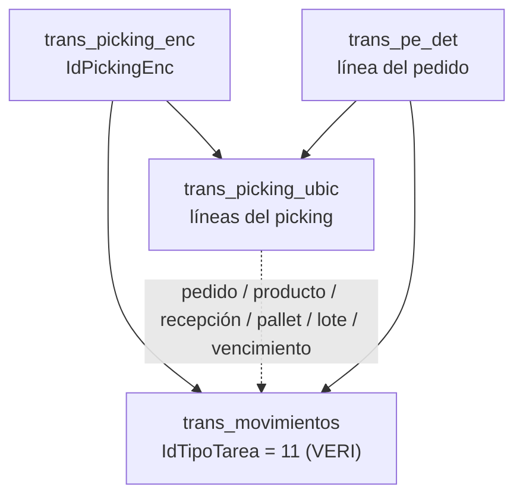

# Análisis técnico de duplicación de movimientos de verificación

## 1. Resumen ejecutivo

Durante la revisión del proceso de verificación de picking se identificó un patrón consistente de duplicación de movimientos tipo `VERI` en la tabla de movimientos de inventario.

El caso analizado corresponde al picking `1628`. La evidencia muestra que determinados movimientos de verificación fueron registrados más de una vez con la misma llave operativa: mismo pedido, producto, recepción, licencia/pallet, lote, ubicación y cantidad. Esto provoca que el movimiento de inventario represente una cantidad superior a la realmente verificada en las líneas operativas del picking.

El hallazgo principal es que la duplicación no parece originarse por una diferencia de cantidad capturada por el operador, sino por una reinserción del mismo conjunto lógico de movimientos de verificación.

## 2. Alcance del análisis

El análisis se enfocó en las siguientes entidades del flujo de picking y verificación:

| Entidad | Rol en el flujo |
| --- | --- |
| `trans_picking_enc` | Encabezado del picking |
| `trans_picking_ubic` | Líneas operativas del picking, con cantidades recibidas y verificadas |
| `trans_movimientos` | Movimientos de inventario generados por tareas operativas |
| `sis_tipo_tarea` | Catálogo de tipos de tarea, incluyendo `VERI` |
| `tarea_hh` | Cola de tareas para terminal handheld |

El tipo de tarea analizado fue:

| IdTipoTarea | Nombre | Descripción funcional |
| ---: | --- | --- |
| 11 | `VERI` | Movimiento de verificación de picking |

## 3. Modelo lógico observado

Para movimientos de verificación, la relación operativa observada es:



En este flujo:

- `trans_movimientos.IdTransaccion` representa el `IdPickingEnc`.
- `trans_movimientos.IdPedidoEnc` e `IdPedidoDet` vinculan el movimiento con la línea del pedido.
- `trans_movimientos.IdRecepcion` e `IdRecepcionDet` vinculan el movimiento con la recepción de origen.
- `trans_movimientos.barra_pallet`, `lote` y `fecha_vence` permiten relacionar el movimiento con la línea operativa de picking.

## 4. Evidencia del caso analizado

Para el picking `1628` se observó el siguiente estado general:

| Indicador | Valor |
| --- | ---: |
| Picking analizado | 1628 |
| Estado del picking | Procesado |
| Procesado desde BOF | Sí |
| Verificación automática | No |
| Líneas operativas de picking | 64 |
| Cantidad recibida en líneas de picking | 6,552 |
| Cantidad verificada en líneas de picking | 6,552 |

### Grupo representativo

Uno de los grupos donde se confirmó el patrón corresponde a:

| Campo | Valor |
| --- | --- |
| Línea de pedido | 2 |
| IdPedidoDet | 24055 |
| IdProductoBodega | 4233 |
| Licencia / pallet | `MXL54480460040043` |
| Lote | `L62226036CAFR` |
| Fecha de vencimiento | 2026-12-05 |

Las líneas operativas de picking del grupo tienen estas cantidades verificadas:

| IdPickingUbic | Cantidad verificada |
| ---: | ---: |
| 48370 | 76 |
| 48371 | 33 |
| 48372 | 5 |
| 48373 | 38 |
| 48374 | 16 |
| **Total esperado** | **168** |

Sin embargo, los movimientos `VERI` asociados al mismo grupo registran:

| Indicador | Valor |
| --- | ---: |
| Movimientos `VERI` encontrados | 15 |
| Cantidad total en movimientos `VERI` | 504 |
| Cantidad esperada según picking | 168 |
| Factor observado | 3x |
| Exceso observado | 336 |

La diferencia se explica porque el mismo conjunto de cantidades `76`, `33`, `5`, `38` y `16` aparece registrado tres veces.

## 5. Diagnóstico

El patrón observado corresponde a una duplicación exacta de movimientos de verificación.

Se considera duplicado exacto cuando dos o más movimientos `VERI` coinciden en la siguiente llave lógica:

| Componente de llave | Propósito |
| --- | --- |
| `IdTransaccion` | Picking |
| `IdPedidoEnc`, `IdPedidoDet` | Pedido y línea del pedido |
| `IdRecepcion`, `IdRecepcionDet` | Recepción de origen |
| `IdProductoBodega` | Producto en bodega |
| `IdUbicacionOrigen`, `IdUbicacionDestino` | Movimiento entre ubicaciones |
| `IdPresentacion`, `IdUnidadMedida` | Presentación y unidad de medida |
| `IdEstadoOrigen`, `IdEstadoDestino` | Estados de inventario |
| `barra_pallet` | Licencia o pallet |
| `lote` | Lote |
| `fecha_vence` | Fecha de vencimiento |
| `cantidad` | Cantidad del movimiento |

Cuando esa llave se repite, el movimiento representa el mismo hecho operativo registrado más de una vez.

## 6. Hipótesis de causa raíz

La hipótesis principal es que el origen está asociado a la reejecución del proceso de verificación desde BOF sobre líneas o pickings que ya tenían movimientos `VERI` registrados.

El flujo observado indica que, al ejecutar la opción de verificar pickeados desde BOF, el sistema puede volver a insertar movimientos de verificación para líneas que ya fueron verificadas previamente.

En términos funcionales, el proceso debería comportarse de una de estas formas:

1. Procesar únicamente líneas pendientes de verificación.
2. Eliminar y reconstruir los movimientos de verificación del grupo antes de volver a insertarlos.
3. Conservar movimientos previos y bloquear la reinserción de movimientos duplicados.

Actualmente, la evidencia sugiere que el flujo puede reinsertar movimientos sin una validación suficiente de idempotencia.

## 7. Impacto funcional

El principal riesgo está en la representación del inventario y de los movimientos históricos.

Aunque las líneas operativas del picking muestran la cantidad verificada correcta, los movimientos de inventario pueden quedar sobre-representados. Esto puede afectar:

- consultas de trazabilidad de movimientos;
- reportes de verificación;
- análisis de kardex o historial de inventario;
- conciliaciones entre cantidades verificadas y movimientos generados;
- procesos posteriores que dependan de `trans_movimientos`.

En el caso representativo, la línea operativa esperaba `168`, pero los movimientos acumularon `504`, es decir, tres veces la cantidad real.

## 8. Criterio propuesto para regularización

Para una primera regularización controlada se recomienda corregir únicamente duplicados exactos.

El criterio conservador es:

1. Agrupar movimientos `VERI` por la llave lógica completa.
2. Ordenar los movimientos repetidos por `IdMovimiento`.
3. Conservar un único movimiento como registro canónico.
4. Marcar los movimientos restantes como candidatos a depuración.
5. Antes de ejecutar cualquier eliminación, simular el resultado y confirmar que la suma depurada coincida con la cantidad verificada en `trans_picking_ubic`.

Este enfoque evita intervenir movimientos que no sean duplicados exactos.

## 9. Clasificación recomendada de hallazgos

Para evitar una corrección agresiva, los casos deben separarse en tres categorías:

| Categoría | Descripción | Acción recomendada |
| --- | --- | --- |
| Duplicado exacto | Misma llave lógica y misma cantidad repetida | Depuración controlada |
| Huérfano | Movimiento `VERI` sin línea operativa equivalente clara | Revisión funcional |
| Mismatch | Existe relación, pero cantidades o llaves no coinciden | Análisis caso por caso |

La primera etapa debe enfocarse solamente en duplicados exactos.

## 10. Plan de acción propuesto

Se recomienda avanzar en cuatro pasos:

1. **Validación por picking individual**  
   Usar el picking `1628` como caso base para validar la metodología.

2. **Script de auditoría**  
   Generar reportes de diferencias entre `trans_picking_ubic` y `trans_movimientos` para identificar grupos duplicados, huérfanos y mismatches.

3. **Script transaccional de depuración**  
   Preparar un script que, por defecto, ejecute en modo simulación o con `ROLLBACK`, mostrando antes y después de la depuración.

4. **Corrección preventiva en BOF**  
   Ajustar el proceso de verificación desde BOF para que sea idempotente y no vuelva a insertar movimientos `VERI` ya existentes.

## 11. Controles sugeridos antes de ejecutar cambios

Antes de cualquier depuración productiva se recomienda:

- respaldar la base de datos o las tablas involucradas;
- ejecutar la auditoría en modo solo lectura;
- validar un picking individual con negocio;
- revisar diferencias antes y después;
- ejecutar inicialmente dentro de una transacción con `ROLLBACK`;
- documentar los movimientos candidatos antes de eliminarlos;
- aprobar explícitamente el criterio de cuál movimiento se conserva.

## 12. Conclusión

El análisis confirma un patrón de duplicación exacta de movimientos `VERI` en el proceso de verificación de picking. En el caso estudiado, el mismo conjunto de movimientos fue registrado tres veces, generando una sobre-representación de cantidades en `trans_movimientos`.

La corrección recomendada tiene dos componentes:

1. regularizar datos históricos mediante una depuración conservadora de duplicados exactos;
2. prevenir recurrencia agregando idempotencia al flujo de verificación desde BOF.

Este enfoque permite corregir el caso confirmado sin asumir que todos los movimientos con diferencia son automáticamente eliminables.

## Anexo A. Query de diagnóstico por picking

La siguiente consulta compara la cantidad verificada en las líneas operativas contra la cantidad acumulada en movimientos `VERI`.

```sql
DECLARE @IdPickingEnc INT = 1628;

WITH PickingGrupo AS (
    SELECT
        pu.IdPickingEnc,
        pu.IdPedidoEnc,
        pu.IdPedidoDet,
        pd.no_linea AS NoLineaPedido,
        pd.Cantidad AS CantidadPedido,
        pu.IdProductoBodega,
        pu.Lic_plate,
        pu.Lote,
        pu.Fecha_Vence,
        pu.IdRecepcion,
        COUNT(*) AS LineasPickingUbic,
        MIN(pu.IdPickingUbic) AS PrimerIdPickingUbic,
        MAX(pu.IdPickingUbic) AS UltimoIdPickingUbic,
        SUM(ISNULL(pu.Cantidad_Solicitada, 0)) AS CantidadSolicitadaPickingUbic,
        SUM(ISNULL(pu.Cantidad_Recibida, 0)) AS CantidadRecibidaPickingUbic,
        SUM(ISNULL(pu.Cantidad_Verificada, 0)) AS CantidadVerificadaPickingUbic
    FROM trans_picking_ubic pu
    LEFT JOIN trans_pe_det pd
        ON pd.IdPedidoEnc = pu.IdPedidoEnc
       AND pd.IdPedidoDet = pu.IdPedidoDet
    WHERE pu.IdPickingEnc = @IdPickingEnc
    GROUP BY
        pu.IdPickingEnc,
        pu.IdPedidoEnc,
        pu.IdPedidoDet,
        pd.no_linea,
        pd.Cantidad,
        pu.IdProductoBodega,
        pu.Lic_plate,
        pu.Lote,
        pu.Fecha_Vence,
        pu.IdRecepcion
),
MovGrupo AS (
    SELECT
        m.IdTransaccion AS IdPickingEnc,
        m.IdPedidoEnc,
        m.IdPedidoDet,
        m.IdProductoBodega,
        m.barra_pallet AS Lic_plate,
        m.lote AS Lote,
        m.fecha_vence AS Fecha_Vence,
        m.IdRecepcion,
        COUNT(*) AS MovimientosVERI,
        SUM(ISNULL(m.cantidad, 0)) AS CantidadVerificadaMovVERI,
        MIN(m.IdMovimiento) AS PrimerIdMovimiento,
        MAX(m.IdMovimiento) AS UltimoIdMovimiento
    FROM trans_movimientos m
    WHERE m.IdTipoTarea = 11
      AND m.IdTransaccion = @IdPickingEnc
    GROUP BY
        m.IdTransaccion,
        m.IdPedidoEnc,
        m.IdPedidoDet,
        m.IdProductoBodega,
        m.barra_pallet,
        m.lote,
        m.fecha_vence,
        m.IdRecepcion
)
SELECT
    pg.IdPickingEnc,
    pg.IdPedidoEnc,
    pg.IdPedidoDet,
    pg.NoLineaPedido,
    pg.CantidadPedido,
    pg.IdProductoBodega,
    pg.Lic_plate,
    pg.Lote,
    pg.Fecha_Vence,
    pg.IdRecepcion,
    pg.LineasPickingUbic,
    pg.PrimerIdPickingUbic,
    pg.UltimoIdPickingUbic,
    pg.CantidadSolicitadaPickingUbic,
    pg.CantidadRecibidaPickingUbic,
    pg.CantidadVerificadaPickingUbic,
    ISNULL(mg.MovimientosVERI, 0) AS MovimientosVERI,
    ISNULL(mg.CantidadVerificadaMovVERI, 0) AS CantidadVerificadaMovVERI,
    ISNULL(mg.CantidadVerificadaMovVERI, 0)
        - ISNULL(pg.CantidadVerificadaPickingUbic, 0) AS DiferenciaMovVsPickingUbic,
    CASE
        WHEN ISNULL(pg.CantidadVerificadaPickingUbic, 0) = 0 THEN NULL
        ELSE ISNULL(mg.CantidadVerificadaMovVERI, 0)
             / NULLIF(pg.CantidadVerificadaPickingUbic, 0)
    END AS FactorMovVsPickingUbic,
    mg.PrimerIdMovimiento,
    mg.UltimoIdMovimiento
FROM PickingGrupo pg
LEFT JOIN MovGrupo mg
    ON mg.IdPickingEnc = pg.IdPickingEnc
   AND mg.IdPedidoEnc = pg.IdPedidoEnc
   AND mg.IdPedidoDet = pg.IdPedidoDet
   AND mg.IdProductoBodega = pg.IdProductoBodega
   AND ISNULL(mg.Lic_plate COLLATE DATABASE_DEFAULT, '')
       = ISNULL(pg.Lic_plate COLLATE DATABASE_DEFAULT, '')
   AND ISNULL(mg.Lote COLLATE DATABASE_DEFAULT, '')
       = ISNULL(pg.Lote COLLATE DATABASE_DEFAULT, '')
   AND ISNULL(mg.Fecha_Vence, '19000101') = ISNULL(pg.Fecha_Vence, '19000101')
   AND ISNULL(mg.IdRecepcion, 0) = ISNULL(pg.IdRecepcion, 0)
WHERE ISNULL(mg.MovimientosVERI, 0) > 0
ORDER BY
    DiferenciaMovVsPickingUbic DESC,
    FactorMovVsPickingUbic DESC,
    pg.IdPedidoDet,
    pg.Lic_plate;
```

## Anexo B. Query de candidatos por duplicado exacto

La siguiente consulta enumera movimientos repetidos. No elimina datos.

```sql
DECLARE @IdPickingEnc INT = 1628;

WITH VeriRank AS (
    SELECT
        m.IdMovimiento,
        m.IdTipoTarea,
        m.IdTransaccion AS IdPickingEnc,
        m.IdPedidoEnc,
        m.IdPedidoDet,
        m.IdRecepcion,
        m.IdRecepcionDet,
        m.IdProductoBodega,
        m.IdUbicacionOrigen,
        m.IdUbicacionDestino,
        m.IdPresentacion,
        m.IdEstadoOrigen,
        m.IdEstadoDestino,
        m.IdUnidadMedida,
        m.barra_pallet,
        m.lote,
        m.fecha_vence,
        m.cantidad,
        ROW_NUMBER() OVER (
            PARTITION BY
                m.IdTipoTarea,
                m.IdTransaccion,
                m.IdPedidoEnc,
                m.IdPedidoDet,
                m.IdRecepcion,
                m.IdRecepcionDet,
                m.IdProductoBodega,
                m.IdUbicacionOrigen,
                m.IdUbicacionDestino,
                m.IdPresentacion,
                m.IdEstadoOrigen,
                m.IdEstadoDestino,
                m.IdUnidadMedida,
                ISNULL(m.barra_pallet COLLATE DATABASE_DEFAULT, ''),
                ISNULL(m.lote COLLATE DATABASE_DEFAULT, ''),
                ISNULL(m.fecha_vence, '19000101'),
                m.cantidad
            ORDER BY m.IdMovimiento
        ) AS NumeroRepeticion,
        COUNT(*) OVER (
            PARTITION BY
                m.IdTipoTarea,
                m.IdTransaccion,
                m.IdPedidoEnc,
                m.IdPedidoDet,
                m.IdRecepcion,
                m.IdRecepcionDet,
                m.IdProductoBodega,
                m.IdUbicacionOrigen,
                m.IdUbicacionDestino,
                m.IdPresentacion,
                m.IdEstadoOrigen,
                m.IdEstadoDestino,
                m.IdUnidadMedida,
                ISNULL(m.barra_pallet COLLATE DATABASE_DEFAULT, ''),
                ISNULL(m.lote COLLATE DATABASE_DEFAULT, ''),
                ISNULL(m.fecha_vence, '19000101'),
                m.cantidad
        ) AS TotalRepeticiones
    FROM trans_movimientos m
    WHERE m.IdTipoTarea = 11
      AND m.IdTransaccion = @IdPickingEnc
)
SELECT *
FROM VeriRank
WHERE TotalRepeticiones > 1
ORDER BY
    IdPedidoDet,
    barra_pallet,
    lote,
    cantidad,
    NumeroRepeticion,
    IdMovimiento;
```
